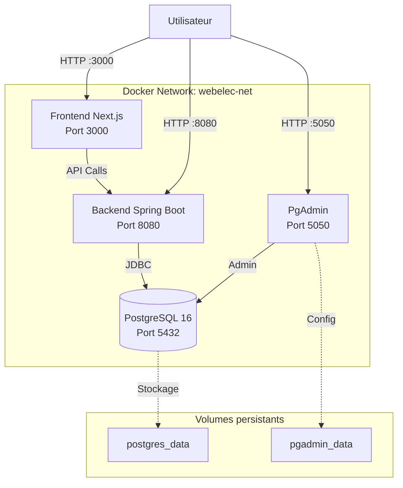

# Guide Docker - WebElec SaaS

<div align="center">
  
  <h2>Déploiement conteneurisé de WebElec SaaS</h2>
  <p><em>Stack complète : PostgreSQL + Spring Boot + Next.js + PgAdmin</em></p>
</div>

---

## 📚 Table des matières

1. [Vue d'ensemble](#-vue-densemble)
2. [Prérequis](#-prérequis)
3. [Architecture des conteneurs](#-architecture-des-conteneurs)
4. [Démarrage rapide](#-démarrage-rapide)
5. [Accès aux services](#-accès-aux-services)
6. [Configuration](#️-configuration)
7. [Gestion des données](#-gestion-des-données)
8. [Logs et monitoring](#-logs-et-monitoring)
9. [Environnement de production](#-environnement-de-production)
10. [Maintenance](#-maintenance)
11. [Troubleshooting](#-troubleshooting)

---

## 🎯 Vue d'ensemble

WebElec SaaS utilise **Docker Compose** pour orchestrer une stack complète de 4 conteneurs :

| Service | Conteneur | Port | Description |
|---------|-----------|------|-------------|
| **PostgreSQL** | `webelec-postgres` | 5432 | Base de données principale |
| **PgAdmin** | `webelec-pgadmin` | 5050 | Interface d'administration BDD |
| **Backend** | `webelec-backend` | 8080 | API REST Spring Boot |
| **Frontend** | `webelec-frontend` | 3000 | Interface utilisateur Next.js |

### Avantages de Docker

✅ **Isolation** : Chaque service dans son propre conteneur
✅ **Portabilité** : Fonctionne sur Windows, Mac, Linux
✅ **Reproductibilité** : Même environnement partout
✅ **Scalabilité** : Facile à déployer en production
✅ **Maintenance** : Updates et rollbacks simplifiés

---

## 🔧 Prérequis

### Installation de Docker

#### Windows

1. Téléchargez [Docker Desktop pour Windows](https://www.docker.com/products/docker-desktop/)
2. Installez en suivant l'assistant
3. Redémarrez votre ordinateur
4. Lancez Docker Desktop
5. Vérifiez l'installation :
   ```bash
   docker --version
   docker-compose --version
   ```

#### macOS

1. Téléchargez [Docker Desktop pour Mac](https://www.docker.com/products/docker-desktop/)
2. Glissez Docker.app dans Applications
3. Lancez Docker depuis Applications
4. Vérifiez l'installation :
   ```bash
   docker --version
   docker-compose --version
   ```

#### Linux (Ubuntu/Debian)

```bash
# Installation de Docker
sudo apt update
sudo apt install docker.io docker-compose

# Ajouter votre utilisateur au groupe docker
sudo usermod -aG docker $USER

# Redémarrer la session ou :
newgrp docker

# Vérification
docker --version
docker-compose --version
```

### Configuration système minimale

- **RAM** : 8 GB recommandé (4 GB minimum)
- **Disque** : 10 GB d'espace libre
- **CPU** : 2 cœurs minimum

---

## 🏗️ Architecture des conteneurs

### Diagramme de l'infrastructure



### Dépendances entre services

```
PostgreSQL (démarre en premier)
    ↓
Backend (attend PostgreSQL)
    ↓
Frontend (attend Backend)

PgAdmin (attend PostgreSQL)
```

### Réseau Docker

Tous les conteneurs communiquent via le réseau privé `webelec-net` :
- Communication inter-conteneurs : Noms de service (`postgres`, `backend`, `frontend`)
- Communication externe : Ports mappés sur `localhost`

---

## 🚀 Démarrage rapide

### 1. Cloner le projet

```bash
git clone https://github.com/votre-repo/webelec-saas.git
cd webelec-saas
```

### 2. Vérifier les fichiers Docker

Assurez-vous que ces fichiers existent :

```bash
webelec-saas/
├── docker-compose.yml          # Configuration dev
├── docker-compose.prod.yml     # Configuration production
├── backend/
│   └── Dockerfile              # Image Spring Boot
└── frontend/
    └── Dockerfile              # Image Next.js
```

### 3. Lancer la stack complète

```bash
# Construire et démarrer tous les services
docker-compose up -d

# Vérifier que tout fonctionne
docker-compose ps
```

**Sortie attendue :**
```
NAME                  IMAGE                    STATUS
webelec-postgres      postgres:16              Up
webelec-pgadmin       dpage/pgadmin4:8.9       Up
webelec-backend       webelec-saas-backend     Up
webelec-frontend      webelec-saas-frontend    Up
```

### 4. Attendre le démarrage complet

Le démarrage complet prend environ **2-3 minutes** :

1. **PostgreSQL** démarre en ~10 secondes
2. **Backend** compile et démarre en ~60-90 secondes
3. **Frontend** build et démarre en ~30-60 secondes

**Suivre le démarrage en temps réel :**

```bash
# Logs de tous les services
docker-compose logs -f

# Logs d'un service spécifique
docker-compose logs -f backend
```

### 5. Vérifier l'accès

Une fois démarré, testez chaque service :

```bash
# PostgreSQL
docker exec -it webelec-postgres pg_isready -U postgres

# Backend API
curl http://localhost:8080/api/actuator/health

# Frontend
curl http://localhost:3000
```

---

## 🌐 Accès aux services

### Frontend - Interface utilisateur

- **URL** : http://localhost:3000
- **Description** : Application Next.js
- **Première page** : Page de login
- **Documentation** : Voir [GUIDE_UTILISATEUR.md](GUIDE_UTILISATEUR.md)

### Backend - API REST

- **URL API** : http://localhost:8080/api
- **URL Actuator** : http://localhost:8080/actuator
- **Health Check** : http://localhost:8080/actuator/health
- **Documentation Swagger** : http://localhost:8080/swagger-ui.html

**Exemples d'endpoints** :
```bash
# Authentification
curl -X POST http://localhost:8080/api/auth/login \
  -H "Content-Type: application/json" \
  -d '{"email":"user@example.com","motDePasse":"password"}'

# Liste des sociétés (nécessite authentification)
curl http://localhost:8080/api/societes \
  -H "Authorization: Bearer YOUR_TOKEN"
```

### PgAdmin - Administration PostgreSQL

- **URL** : http://localhost:5050
- **Email** : `admin@webelec.be`
- **Mot de passe** : `admin123`

**Connexion à PostgreSQL depuis PgAdmin** :

1. Ouvrez http://localhost:5050
2. Connectez-vous avec les identifiants ci-dessus
3. Clic droit sur "Servers" → "Register" → "Server"
4. **General** :
   - Name : `WebElec Local`
5. **Connection** :
   - Host : `postgres` (nom du conteneur Docker)
   - Port : `5432`
   - Username : `postgres`
   - Password : `postgres`
   - Save password : ✓
6. Cliquez sur "Save"

### PostgreSQL - Base de données

- **Host** : `localhost` (depuis votre machine)
- **Host** : `postgres` (depuis un autre conteneur Docker)
- **Port** : `5432`
- **Database** : `webelec`
- **Username** : `postgres`
- **Password** : `postgres`

**Connexion directe via psql** :

```bash
# Depuis votre machine (si psql est installé)
psql -h localhost -U postgres -d webelec

# Depuis le conteneur PostgreSQL
docker exec -it webelec-postgres psql -U postgres -d webelec
```

---

## ⚙️ Configuration

### Variables d'environnement

#### Backend (Spring Boot)

Configurées dans `docker-compose.yml` :

```yaml
environment:
  SPRING_PROFILES_ACTIVE: dev                                    # Profil Spring
  SPRING_DATASOURCE_URL: jdbc:postgresql://postgres:5432/webelec # URL BDD
  SPRING_DATASOURCE_USERNAME: postgres                           # User BDD
  SPRING_DATASOURCE_PASSWORD: postgres                           # Password BDD
```

**Variables supplémentaires disponibles** :

```yaml
# JWT Configuration
JWT_SECRET: "votre-secret-base64"
JWT_ACCESS_TOKEN_VALIDITY: "PT1H"          # 1 heure
JWT_REFRESH_TOKEN_VALIDITY: "P7D"          # 7 jours

# Logging
LOGGING_LEVEL_ROOT: INFO
LOGGING_LEVEL_COM_WEBELEC: DEBUG

# Upload de fichiers
UPLOAD_DIR: /app/uploads
MAX_FILE_SIZE: 10MB
```

#### Frontend (Next.js)

Configurées dans `docker-compose.yml` :

```yaml
environment:
  NEXT_PUBLIC_API_BASE: "http://localhost:8080/api"
  NEXT_PUBLIC_API_URL: "http://localhost:8080/api"
```

**Variables supplémentaires disponibles** :

```yaml
# OpenAI (pour l'assistant IA)
OPENAI_API_KEY: "sk-..."

# Configuration
NODE_ENV: production
```

### Fichier .env (optionnel)

Pour éviter de coder les secrets en dur, créez un fichier `.env` :

```bash
# .env
POSTGRES_PASSWORD=mon_mot_de_passe_securise
PGADMIN_PASSWORD=admin_password_securise
JWT_SECRET=mon_secret_jwt_tres_long_et_securise
OPENAI_API_KEY=sk-xxxxxxxxxxxxx
```

Puis référencez dans `docker-compose.yml` :

```yaml
environment:
  POSTGRES_PASSWORD: ${POSTGRES_PASSWORD}
```

⚠️ **Important** : Ajoutez `.env` au `.gitignore` !

### Ports personnalisés

Pour changer les ports exposés, modifiez `docker-compose.yml` :

```yaml
services:
  frontend:
    ports:
      - "80:3000"      # Accès sur http://localhost au lieu de :3000

  backend:
    ports:
      - "8081:8080"    # Accès sur http://localhost:8081
```

---

## 💾 Gestion des données

### Volumes Docker

Les données persistantes sont stockées dans des volumes Docker :

| Volume | Contenu | Taille estimée |
|--------|---------|----------------|
| `postgres_data` | Base de données PostgreSQL | Variable (~100 MB - 10 GB) |
| `pgadmin_data` | Configuration PgAdmin | ~50 MB |

### Lister les volumes

```bash
docker volume ls | grep webelec
```

**Sortie** :
```
webelec-saas_postgres_data
webelec-saas_pgadmin_data
```

### Inspecter un volume

```bash
docker volume inspect webelec-saas_postgres_data
```

### Backup de la base de données

#### Backup manuel

```bash
# Dump de la BDD complète
docker exec webelec-postgres pg_dump -U postgres webelec > backup_$(date +%Y%m%d_%H%M%S).sql

# Dump compressé
docker exec webelec-postgres pg_dump -U postgres webelec | gzip > backup_$(date +%Y%m%d_%H%M%S).sql.gz
```

#### Restauration depuis un backup

```bash
# Depuis un fichier .sql
docker exec -i webelec-postgres psql -U postgres webelec < backup_20250110_120000.sql

# Depuis un fichier .sql.gz
gunzip -c backup_20250110_120000.sql.gz | docker exec -i webelec-postgres psql -U postgres webelec
```

#### Script de backup automatique

```bash
#!/bin/bash
# backup.sh - À exécuter via cron

BACKUP_DIR="/backups/webelec"
TIMESTAMP=$(date +%Y%m%d_%H%M%S)
BACKUP_FILE="$BACKUP_DIR/webelec_$TIMESTAMP.sql.gz"

# Créer le répertoire si nécessaire
mkdir -p $BACKUP_DIR

# Effectuer le backup
docker exec webelec-postgres pg_dump -U postgres webelec | gzip > $BACKUP_FILE

# Garder seulement les 30 derniers backups
ls -t $BACKUP_DIR/webelec_*.sql.gz | tail -n +31 | xargs rm -f

echo "Backup créé : $BACKUP_FILE"
```

**Configuration cron (backup quotidien à 2h du matin)** :

```bash
crontab -e

# Ajouter :
0 2 * * * /path/to/backup.sh >> /var/log/webelec-backup.log 2>&1
```

### Nettoyage des volumes

⚠️ **Attention** : Supprime toutes les données !

```bash
# Arrêter les conteneurs
docker-compose down

# Supprimer les volumes
docker-compose down -v

# Redémarrer avec une base vierge
docker-compose up -d
```

---

## 📊 Logs et monitoring

### Consulter les logs

```bash
# Tous les services
docker-compose logs

# Un service spécifique
docker-compose logs backend

# Suivre en temps réel
docker-compose logs -f

# Dernières 100 lignes
docker-compose logs --tail=100

# Avec timestamps
docker-compose logs -t
```

### Logs Spring Boot (Backend)

```bash
# Logs applicatifs
docker-compose logs backend | grep "com.webelec"

# Erreurs uniquement
docker-compose logs backend | grep ERROR

# Requêtes SQL
docker-compose logs backend | grep "Hibernate:"
```

### Statistiques des conteneurs

```bash
# CPU, RAM, Network, I/O en temps réel
docker stats

# Un seul conteneur
docker stats webelec-backend
```

### Inspecter un conteneur

```bash
# Informations détaillées
docker inspect webelec-backend

# IP du conteneur
docker inspect webelec-backend | grep IPAddress

# Variables d'environnement
docker inspect webelec-backend | grep -A 20 Env
```

### Exécuter des commandes dans un conteneur

```bash
# Shell dans le backend
docker exec -it webelec-backend /bin/bash

# Shell dans PostgreSQL
docker exec -it webelec-postgres /bin/bash

# Commande ponctuelle
docker exec webelec-backend ls -la /app
```

---

## 🏭 Environnement de production

### Fichier docker-compose.prod.yml

Pour la production, utilisez `docker-compose.prod.yml` avec des configurations optimisées.

**Différences clés dev vs prod** :

| Aspect | Dev | Production |
|--------|-----|------------|
| Build | Hot reload | Optimized build |
| Secrets | En clair | Variables d'environnement |
| Logs | Verbose (DEBUG) | INFO/WARN |
| Restart | manual | always |
| Health checks | Optionnel | Obligatoire |
| Ressources | Illimitées | Limitées (CPU/RAM) |

### Déployer en production

```bash
# Build et démarrage en mode production
docker-compose -f docker-compose.prod.yml up -d --build

# Vérifier le statut
docker-compose -f docker-compose.prod.yml ps

# Suivre les logs
docker-compose -f docker-compose.prod.yml logs -f
```

### Optimisations production

#### 1. Utiliser des secrets Docker

```yaml
# docker-compose.prod.yml
services:
  backend:
    secrets:
      - postgres_password
      - jwt_secret
    environment:
      SPRING_DATASOURCE_PASSWORD_FILE: /run/secrets/postgres_password

secrets:
  postgres_password:
    external: true
  jwt_secret:
    external: true
```

#### 2. Ajouter des health checks

```yaml
services:
  backend:
    healthcheck:
      test: ["CMD", "curl", "-f", "http://localhost:8080/actuator/health"]
      interval: 30s
      timeout: 10s
      retries: 3
      start_period: 60s

  postgres:
    healthcheck:
      test: ["CMD-SHELL", "pg_isready -U postgres"]
      interval: 10s
      timeout: 5s
      retries: 5
```

#### 3. Limiter les ressources

```yaml
services:
  backend:
    deploy:
      resources:
        limits:
          cpus: '2'
          memory: 2G
        reservations:
          cpus: '1'
          memory: 1G
```

#### 4. Utiliser un reverse proxy (Nginx)

```yaml
services:
  nginx:
    image: nginx:alpine
    ports:
      - "80:80"
      - "443:443"
    volumes:
      - ./nginx.conf:/etc/nginx/nginx.conf:ro
      - ./ssl:/etc/nginx/ssl:ro
    depends_on:
      - frontend
      - backend
```

### Mise à jour en production (zero-downtime)

```bash
# 1. Pull des nouvelles images
docker-compose -f docker-compose.prod.yml pull

# 2. Rebuild si nécessaire
docker-compose -f docker-compose.prod.yml build

# 3. Restart rolling (un service à la fois)
docker-compose -f docker-compose.prod.yml up -d --no-deps --build backend
docker-compose -f docker-compose.prod.yml up -d --no-deps --build frontend

# 4. Vérifier
docker-compose -f docker-compose.prod.yml ps
```

---

## 🔧 Maintenance

### Commandes courantes

```bash
# Arrêter tous les services
docker-compose stop

# Démarrer les services arrêtés
docker-compose start

# Redémarrer un service
docker-compose restart backend

# Rebuild un service après modification du code
docker-compose up -d --build backend

# Voir les processus en cours
docker-compose top

# Supprimer les conteneurs arrêtés
docker-compose rm
```

### Mise à jour des images

```bash
# Pull des nouvelles versions
docker-compose pull

# Rebuild et redémarrage
docker-compose up -d --build
```

### Nettoyage Docker

```bash
# Supprimer les images non utilisées
docker image prune

# Supprimer les conteneurs arrêtés
docker container prune

# Supprimer les volumes non utilisés
docker volume prune

# Nettoyage complet (ATTENTION : supprime tout !)
docker system prune -a --volumes
```

### Monitoring de l'espace disque

```bash
# Espace utilisé par Docker
docker system df

# Détails
docker system df -v
```

---

## 🔍 Troubleshooting

### Problème : Le backend ne démarre pas

**Symptômes** :
```bash
docker-compose logs backend
# Erreur : Could not connect to database
```

**Solutions** :

1. **Vérifier que PostgreSQL est démarré** :
   ```bash
   docker-compose ps postgres
   ```

2. **Attendre que PostgreSQL soit prêt** :
   ```bash
   docker exec webelec-postgres pg_isready -U postgres
   ```

3. **Vérifier les credentials** :
   ```bash
   docker exec -it webelec-postgres psql -U postgres -d webelec
   ```

4. **Redémarrer le backend** :
   ```bash
   docker-compose restart backend
   ```

### Problème : Port déjà utilisé

**Symptômes** :
```
Error: Bind for 0.0.0.0:8080 failed: port is already allocated
```

**Solutions** :

1. **Identifier le processus qui utilise le port** :
   ```bash
   # Linux/Mac
   lsof -i :8080

   # Windows
   netstat -ano | findstr :8080
   ```

2. **Tuer le processus** ou **changer le port** dans `docker-compose.yml` :
   ```yaml
   ports:
     - "8081:8080"
   ```

### Problème : Frontend ne se connecte pas au backend

**Symptômes** :
- Erreur CORS
- Network error dans la console navigateur

**Solutions** :

1. **Vérifier l'URL de l'API** :
   ```bash
   docker exec webelec-frontend env | grep API
   ```

2. **Vérifier depuis le conteneur frontend** :
   ```bash
   docker exec webelec-frontend curl http://backend:8080/actuator/health
   ```

3. **Vérifier la configuration CORS du backend** :
   - Fichier : `backend/src/main/java/com/webelec/backend/config/CorsConfig.java`

### Problème : Volumes de données perdus

**Symptômes** :
- Base de données vide après redémarrage

**Solutions** :

1. **Ne jamais utiliser `docker-compose down -v` en production**

2. **Restaurer depuis un backup** :
   ```bash
   docker exec -i webelec-postgres psql -U postgres webelec < backup.sql
   ```

3. **Vérifier que les volumes existent** :
   ```bash
   docker volume ls | grep postgres
   ```

### Problème : Build échoue

**Symptômes** :
```
Error: failed to solve: failed to compute cache key
```

**Solutions** :

1. **Build sans cache** :
   ```bash
   docker-compose build --no-cache
   ```

2. **Nettoyer le build cache** :
   ```bash
   docker builder prune
   ```

3. **Vérifier les Dockerfiles** :
   - `backend/Dockerfile`
   - `frontend/Dockerfile`

### Problème : Conteneur redémarre en boucle

**Symptômes** :
```bash
docker-compose ps
# Status: Restarting
```

**Solutions** :

1. **Consulter les logs** :
   ```bash
   docker-compose logs --tail=50 backend
   ```

2. **Désactiver le restart automatique** temporairement :
   ```yaml
   restart: "no"
   ```

3. **Lancer en mode interactif pour debugger** :
   ```bash
   docker-compose run --rm backend /bin/bash
   ```

### Problème : Performances dégradées

**Solutions** :

1. **Vérifier les ressources allouées à Docker Desktop** :
   - Settings → Resources → Advanced
   - Recommandé : 4 CPU, 8 GB RAM

2. **Vérifier l'utilisation** :
   ```bash
   docker stats
   ```

3. **Optimiser la taille des images** :
   - Utiliser des images slim/alpine
   - Multi-stage builds (déjà implémenté)

---

## 📚 Ressources supplémentaires

### Documentation officielle

- [Docker Documentation](https://docs.docker.com/)
- [Docker Compose](https://docs.docker.com/compose/)
- [PostgreSQL Docker](https://hub.docker.com/_/postgres)
- [Spring Boot + Docker](https://spring.io/guides/topicals/spring-boot-docker/)

### Cheat Sheet Docker

```bash
# CONTENEURS
docker ps                    # Liste des conteneurs actifs
docker ps -a                 # Tous les conteneurs
docker start <container>     # Démarrer
docker stop <container>      # Arrêter
docker restart <container>   # Redémarrer
docker rm <container>        # Supprimer
docker logs <container>      # Logs
docker exec -it <container> /bin/bash  # Shell

# IMAGES
docker images               # Liste des images
docker pull <image>         # Télécharger
docker build -t <name> .    # Builder
docker rmi <image>          # Supprimer
docker image prune          # Nettoyer

# VOLUMES
docker volume ls            # Liste
docker volume inspect <vol> # Détails
docker volume rm <vol>      # Supprimer
docker volume prune         # Nettoyer

# DOCKER COMPOSE
docker-compose up -d        # Démarrer
docker-compose down         # Arrêter et supprimer
docker-compose ps           # Status
docker-compose logs -f      # Logs temps réel
docker-compose restart      # Redémarrer
docker-compose build        # Rebuild
```

---

## 🎯 Checklist de déploiement

Avant de déployer en production :

- [ ] Variables d'environnement configurées (pas de valeurs en dur)
- [ ] Secrets Docker utilisés pour les mots de passe
- [ ] Health checks configurés sur tous les services
- [ ] Limites de ressources définies
- [ ] Logs centralisés configurés
- [ ] Backup automatique de la BDD planifié
- [ ] Monitoring mis en place
- [ ] SSL/TLS configuré (HTTPS)
- [ ] Firewall configuré (ports exposés minimaux)
- [ ] Tests de charge effectués
- [ ] Plan de rollback documenté
- [ ] Documentation à jour

---

<div align="center">
  <p>Créé avec ❤️ pour <strong>WebElec SaaS</strong></p>
  <p><em>Pour toute question, consultez la documentation ou contactez l'équipe technique.</em></p>
</div>
