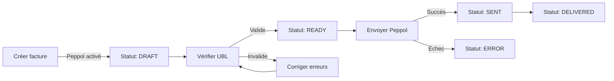

# 📨 Implémentation Peppol - Factures Électroniques

**Date:** 12 février 2026
**Version:** 1.0
**Statut:** ✅ Implémenté

---

## 🎯 Vue d'ensemble

Cette implémentation ajoute le support complet de **Peppol** (Pan-European Public Procurement On-Line) pour la création et la gestion de factures électroniques conformes aux normes européennes.

## ✨ Fonctionnalités ajoutées

### 1. **Backend - Modèle de données**

#### Nouveaux champs dans l'entité `Facture`

| Champ | Type | Description |
|-------|------|-------------|
| `peppolEnabled` | Boolean | Active le mode Peppol pour la facture |
| `peppolSenderEndpointId` | String(100) | ID du point d'accès émetteur (ex: `9925:BE0123456789`) |
| `peppolReceiverEndpointId` | String(100) | ID du point d'accès destinataire |
| `peppolStatus` | String(20) | Statut: DRAFT, READY, SENT, DELIVERED, ERROR |
| `peppolFormat` | String(20) | Format: UBL_2_1 ou CII |
| `peppolSentDate` | LocalDate | Date d'envoi via le réseau Peppol |
| `peppolTransactionId` | String(100) | ID unique de transaction Peppol |
| `peppolErrorMessage` | String(500) | Message d'erreur en cas d'échec |

**Fichiers modifiés :**
- [`backend/src/main/java/com/webelec/backend/model/Facture.java`](backend/src/main/java/com/webelec/backend/model/Facture.java)

### 2. **Backend - DTOs mis à jour**

#### `FactureRequest` - Création de facture

```java
{
  "numero": "FAC-2026-001",
  "dateEmission": "2026-02-12",
  "dateEcheance": "2026-03-12",
  "montantHT": 1000.00,
  "montantTVA": 210.00,
  "montantTTC": 1210.00,
  "statut": "EN_ATTENTE",
  "societeId": 1,
  "clientId": 1,
  "lignes": [...],

  // Nouveaux champs Peppol
  "peppolEnabled": true,
  "peppolSenderEndpointId": "9925:BE0123456789",
  "peppolReceiverEndpointId": "9925:FR98765432100",
  "peppolFormat": "UBL_2_1"
}
```

#### `FactureResponse` - Réponse complète

Tous les champs Peppol sont inclus dans la réponse pour affichage et suivi.

**Fichiers modifiés :**
- [`backend/src/main/java/com/webelec/backend/dto/FactureRequest.java`](backend/src/main/java/com/webelec/backend/dto/FactureRequest.java)
- [`backend/src/main/java/com/webelec/backend/dto/FactureResponse.java`](backend/src/main/java/com/webelec/backend/dto/FactureResponse.java)

### 3. **Backend - API Endpoints**

Les endpoints existants sont automatiquement compatibles Peppol :

- `POST /api/factures` - Créer une facture (Peppol ou standard)
- `GET /api/factures/{id}` - Récupérer une facture avec infos Peppol
- `GET /api/factures/{id}/ubl` - Générer UBL pour vérification
- `POST /api/factures/{id}/peppol` - Envoyer via réseau Peppol

### 4. **Frontend - Composant de création**

#### `FactureCreatePeppolPanel`

Composant React complet pour créer des factures avec support Peppol :

**Caractéristiques :**
- ✅ Activation/désactivation Peppol via checkbox
- ✅ Configuration des identifiants émetteur/destinataire
- ✅ Choix du format (UBL 2.1 ou CII)
- ✅ Validation automatique des champs Peppol
- ✅ Calcul automatique HT, TVA, TTC
- ✅ Gestion multi-lignes de facture
- ✅ Messages d'erreur et de succès clairs

**Fichiers créés :**
- [`frontend/components/facture-create-peppol-panel.tsx`](frontend/components/facture-create-peppol-panel.tsx)
- [`frontend/app/factures/page.tsx`](frontend/app/factures/page.tsx)

### 5. **Frontend - Nouvelle page Factures**

**Route :** `/factures`

**Contenu :**
- Formulaire de création de facture Peppol
- Documentation Peppol intégrée
- Exemples d'identifiants Peppol
- Lien vers la page Peppol pour l'envoi

### 6. **Base de données - Migration**

**Script de migration :** [`V3__add_peppol_fields_to_factures.sql`](backend/src/main/resources/db/migration/V3__add_peppol_fields_to_factures.sql)

```sql
ALTER TABLE factures ADD COLUMN peppol_enabled BOOLEAN DEFAULT FALSE;
ALTER TABLE factures ADD COLUMN peppol_sender_endpoint_id VARCHAR(100);
-- ... autres colonnes

-- Index pour performance
CREATE INDEX idx_factures_peppol_enabled ON factures(peppol_enabled);
CREATE INDEX idx_factures_peppol_status ON factures(peppol_status);
```

### 7. **Navigation - Menu mis à jour**

Le menu de navigation a été enrichi :

**Avant :**
```
... Interventions → Devis → Factures → Peppol ...
```

**Après :**
```
... Interventions → Devis → Créer facture → Import factures → Peppol ...
```

---

## 📖 Guide d'utilisation

### Créer une facture Peppol

1. **Accéder à la page** : `/factures`

2. **Activer Peppol** :
   - Cocher "📨 Activer Peppol"

3. **Configurer les identifiants** :
   - **Émetteur** : `9925:BE0123456789` (votre numéro TVA)
   - **Destinataire** : `9925:FR98765432100` (TVA du client)

4. **Choisir le format** :
   - **UBL 2.1** (recommandé) : Standard XML Peppol
   - **CII** : Alternative UN/CEFACT

5. **Remplir la facture** :
   - Numéro, dates, société, client
   - Ajouter des lignes de facture
   - Les totaux sont calculés automatiquement

6. **Créer** : La facture est créée avec statut `DRAFT`

7. **Vérifier et envoyer** : Aller sur `/peppol` pour :
   - Vérifier la validité UBL
   - Envoyer via le réseau Peppol

---

## 🔧 Format des identifiants Peppol

### Schéma général
```
Scheme:Identifier
```

### Schemes courants

| Code | Type | Pays | Exemple |
|------|------|------|---------|
| `9925` | TVA | EU | `9925:BE0123456789` |
| `9956` | SIRET | FR | `9956:12345678900123` |
| `0088` | GLN | International | `0088:1234567890123` |
| `0184` | DUNS | International | `0184:123456789` |

### Exemples valides

```
✅ 9925:BE0123456789      (TVA belge)
✅ 9925:FR98765432100     (TVA française)
✅ 9925:NL123456789B01    (TVA néerlandaise)
✅ 9956:12345678900123    (SIRET français)
✅ 0088:1234567890123     (GLN)
```

---

## 🔄 Workflow complet



---

## 📊 Statuts Peppol

| Statut | Description |
|--------|-------------|
| `DRAFT` | Facture créée, pas encore vérifiée |
| `READY` | UBL validé, prête à l'envoi |
| `SENT` | Envoyée via le réseau Peppol |
| `DELIVERED` | Reçue par le destinataire |
| `ERROR` | Erreur lors du traitement |

---

## 🎨 Interface utilisateur

### Page `/factures`
![Création de facture Peppol]

**Sections :**
1. **Configuration Peppol** (pliable si désactivé)
2. **Informations de base** (numéro, dates, société, client)
3. **Lignes de facture** (multi-lignes avec calcul auto)
4. **Totaux** (HT, TVA, TTC)
5. **Documentation Peppol** (guides et exemples)

### Page `/peppol`
- **Liste des factures** avec indicateur Peppol
- **Actions** :
  - Vérifier UBL
  - Exporter
  - Envoyer Peppol
- **Statuts visuels** par couleur

---

## ✅ Tests recommandés

### Tests manuels

1. **Créer une facture standard** (Peppol désactivé)
   - ✅ Les champs Peppol restent NULL
   - ✅ Statut normal (BROUILLON)

2. **Créer une facture Peppol** (Peppol activé)
   - ✅ Validation des identifiants obligatoires
   - ✅ Statut `DRAFT` automatique
   - ✅ Format UBL_2_1 par défaut

3. **Vérifier sur `/peppol`**
   - ✅ Facture apparaît avec badge Peppol
   - ✅ Bouton "Vérifier" fonctionne
   - ✅ Génération UBL réussie

4. **Envoyer via Peppol**
   - ✅ Statut passe à `SENT`
   - ✅ Transaction ID enregistré
   - ✅ Date d'envoi remplie

### Tests automatisés (à créer)

```java
@Test
void createPeppolInvoice_ValidData_Success() {
    // Test création facture Peppol avec validation
}

@Test
void createPeppolInvoice_MissingSenderId_ThrowsException() {
    // Test validation identifiant émetteur
}

@Test
void sendPeppolInvoice_UpdatesStatus() {
    // Test changement de statut lors envoi
}
```

---

## 🔐 Sécurité et conformité

### Normes supportées
- ✅ **EN 16931** : Norme européenne de facturation électronique
- ✅ **Directive 2014/55/UE** : Factures électroniques dans les marchés publics
- ✅ **UBL 2.1** : Universal Business Language
- ✅ **UN/CEFACT CII** : Cross Industry Invoice

### Validation
- ✅ Format des identifiants Peppol vérifié
- ✅ Structure UBL validée avant envoi
- ✅ Champs obligatoires contrôlés
- ✅ Traçabilité complète (transaction ID, dates, statuts)

---

## 📚 Ressources

### Documentation officielle
- [Peppol Official](https://peppol.org/)
- [EN 16931 Standard](https://ec.europa.eu/digital-building-blocks/wikis/display/DIGITAL/Compliance+with+eInvoicing+standard)
- [UBL 2.1 Specification](http://docs.oasis-open.org/ubl/UBL-2.1.html)

### Outils de validation
- [Peppol Validator](https://ecosio.com/en/peppol/peppol-and-xml-document-validator/)
- [UBL Schema Validator](http://www.validex.net/)

---

## 🚀 Prochaines étapes (optionnel)

### Améliorations possibles

1. **Génération PDF** avec code QR Peppol
2. **Historique des envois** avec logs détaillés
3. **Notifications** email lors changement de statut
4. **Bulk sending** pour envoi multiple
5. **Templates** de factures Peppol pré-configurées
6. **API webhook** pour réception des accusés
7. **Tableau de bord** analytics Peppol

---

## 📞 Support

Pour toute question sur l'implémentation Peppol :
- 📧 Contact : support@webelec-saas.com
- 📖 Documentation : `/factures` (guide intégré)
- 🔧 Tests : `/peppol` (page de test)

---

**Implémentation réalisée par :** Claude Code (Sonnet 4.5)
**Date :** 12 février 2026
**Version backend :** Spring Boot 3.5.8
**Version frontend :** Next.js 16.1.6
