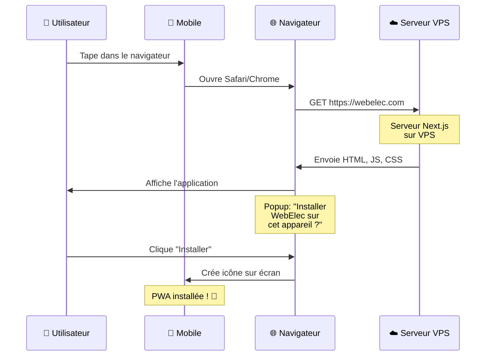
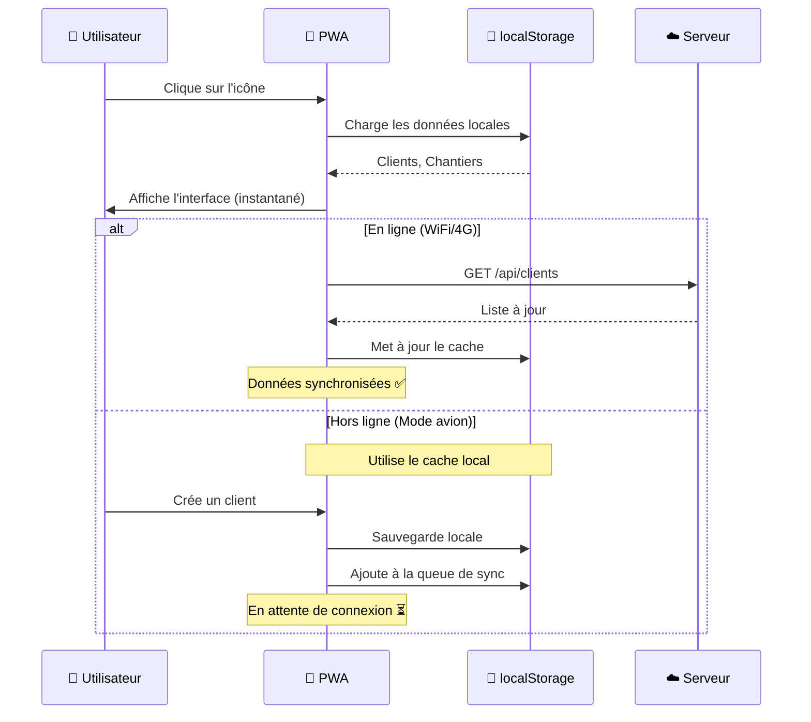
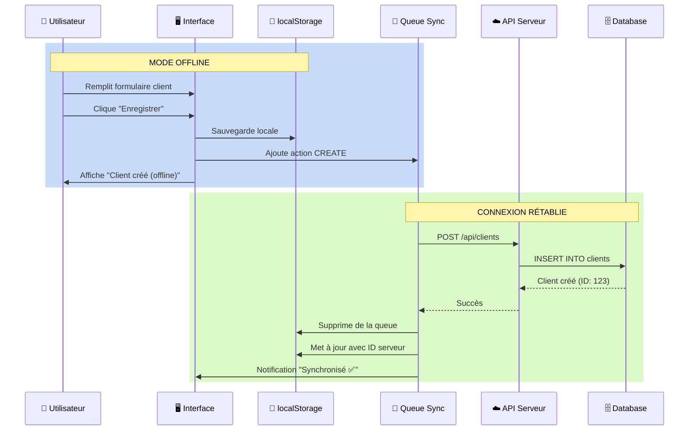

# 📱 Guide PWA - Progressive Web App

## 🎯 Qu'est-ce qu'une PWA ?

Une **PWA (Progressive Web App)** est une application web qui se comporte comme une application mobile native, mais qui est développée avec des technologies web standard (HTML, CSS, JavaScript).

### Analogie simple

Pensez à une PWA comme un **livre numérique** :
- Le **serveur** est la **bibliothèque en ligne** (Amazon, Google Books)
- Vous **téléchargez** le livre une fois sur votre **liseuse/tablette**
- Vous pouvez ensuite **lire offline**, même sans internet
- De temps en temps, le livre se **synchronise** pour récupérer les nouvelles éditions

## 🏗️ Architecture : Serveur vs Client

### Vue d'ensemble

```mermaid
graph TB
    subgraph Internet["🌐 INTERNET"]
        URL[webelec.com]
    end

    subgraph Serveur["☁️ SERVEUR VPS / HÉBERGEMENT"]
        NextJS[Next.js App<br/>Port 3000]
        SpringBoot[Spring Boot API<br/>Port 8080]
        DB[(PostgreSQL<br/>Base de données)]

        NextJS --> SpringBoot
        SpringBoot --> DB
    end

    subgraph Client["📱 APPAREIL UTILISATEUR"]
        direction TB
        Browser[🌐 Navigateur Web]
        PWA[📱 PWA Installée]
        LocalStorage[💾 localStorage]
        Cache[📦 Cache]

        Browser -->|Installe| PWA
        PWA --> LocalStorage
        PWA --> Cache
    end

    URL --> NextJS
    Browser -->|Première visite| NextJS
    PWA -.->|Synchronisation<br/>en ligne| SpringBoot

    style Serveur fill:#fff3e0
    style Client fill:#e3f2fd
    style PWA fill:#4caf50
```



## 📍 Où sont les données ?

### 1. Sur le Serveur (VPS) ☁️

```
Serveur VPS (exemple: DigitalOcean, AWS, OVH)
│
├── 📂 Application Next.js (Frontend)
│   ├── Code source compilé
│   ├── Pages, composants React
│   └── Assets (images, CSS)
│
├── 🔧 API Spring Boot (Backend)
│   ├── Endpoints REST
│   ├── Logique métier
│   └── Authentification JWT
│
└── 🗄️ Base de données PostgreSQL
    ├── Table clients
    ├── Table chantiers
    └── Table utilisateurs
```

**Rôle** :
- Source de vérité des données
- Traitement des requêtes
- Synchronisation entre utilisateurs

### 2. Sur l'Appareil (Mobile/Desktop) 📱

```
Appareil utilisateur (Smartphone, Tablette, PC)
│
├── 🌐 Navigateur (Chrome, Safari, Edge)
│   └── Accès initial à l'application
│
├── 📱 PWA Installée
│   ├── Icône sur l'écran d'accueil
│   ├── Lance en plein écran
│   └── Fonctionne comme une app native
│
├── 💾 localStorage
│   ├── Liste des clients
│   ├── Liste des chantiers
│   ├── Queue de synchronisation
│   └── Photos en base64
│
└── 📦 Cache navigateur
    ├── Code JavaScript
    ├── CSS
    └── Images statiques
```

**Rôle** :
- Fonctionnement offline
- Réactivité instantanée
- Sauvegarde temporaire

## 🔄 Cycle de vie complet

### Phase 1 : Première visite (Pas de PWA)



**Que se passe-t-il ?**

1. **Utilisateur** tape `webelec.com` dans Chrome/Safari
2. **Navigateur** fait une requête HTTP vers le **serveur VPS**
3. **Serveur** renvoie l'application (HTML + JavaScript)
4. **Navigateur** propose d'installer la PWA
5. **PWA** est téléchargée et installée localement

**Où sont les fichiers après installation ?**
- Sur l'appareil, dans le cache du navigateur
- Environ **1-5 MB** d'espace disque
- Accessible via l'icône sur l'écran d'accueil

### Phase 2 : Utilisation quotidienne (PWA installée)



**Que se passe-t-il ?**

1. **Utilisateur** clique sur l'icône WebElec
2. **PWA** s'ouvre instantanément (pas de chargement web)
3. **PWA** charge les données depuis localStorage
4. Si **en ligne** : synchronise avec le serveur
5. Si **offline** : fonctionne avec les données locales

## 💾 Stockage des données

### Comparaison Serveur vs Client

| Aspect | Serveur (VPS) | Client (Appareil) |
|--------|---------------|-------------------|
| **Type** | Base de données PostgreSQL | localStorage du navigateur |
| **Taille** | Illimité (limite du disque) | 5-10 MB par domaine |
| **Persistance** | Permanent | Jusqu'à vidage du cache |
| **Accès offline** | ❌ Non | ✅ Oui |
| **Partagé** | ✅ Tous les utilisateurs | ❌ Un seul utilisateur |
| **Sécurité** | ✅ Très sécurisé | ⚠️ Local (chiffrement possible) |

### Exemple concret

**Sur le serveur** :
```sql
-- Base de données PostgreSQL
SELECT * FROM clients;
┌────┬──────────┬────────────┬─────────────┐
│ id │   nom    │  prenom   │    email    │
├────┼──────────┼────────────┼─────────────┤
│  1 │ Dupont   │ Jean      │ jean@...    │
│  2 │ Martin   │ Sophie    │ sophie@...  │
└────┴──────────┴────────────┴─────────────┘
```

**Sur l'appareil** :
```javascript
// localStorage du navigateur
localStorage.getItem('webelec_clients')
// Retourne:
[
  {id: "1", nom: "Dupont", prenom: "Jean", ...},
  {id: "2", nom: "Martin", prenom: "Sophie", ...}
]
```

## 🌐 Différence : Online vs Offline

### Mode Online (Avec connexion)

```
📱 Appareil
    ↓
💾 Lit dans localStorage (instantané)
    ↓
🌐 Synchronise avec le serveur
    ↓
☁️ Serveur VPS
    ↓
🗄️ Base de données
    ↓
🔄 Met à jour localStorage
```

**Avantages** :
- Interface réactive (lecture locale)
- Données à jour (sync serveur)
- Partage entre appareils

### Mode Offline (Sans connexion)

```
📱 Appareil
    ↓
💾 Lit dans localStorage
    ↓
✏️ Modifications locales
    ↓
📝 Ajout à la queue de sync
    ↓
⏳ En attente de connexion
```

**Comportement** :
- Lecture : Données du cache local
- Écriture : Sauvegarde locale + queue
- Synchronisation : Automatique au retour en ligne

## 🚀 Déploiement complet

### Étape 1 : Hébergement sur VPS

```bash
# Sur votre serveur VPS (Ubuntu/Debian)

# 1. Installation de Node.js
curl -fsSL https://deb.nodesource.com/setup_18.x | sudo -E bash -
sudo apt-get install -y nodejs

# 2. Cloner le projet
git clone https://github.com/votre-repo/webelec-mobile.git
cd webelec-mobile

# 3. Installer les dépendances
npm install

# 4. Build de production
npm run build

# 5. Lancer l'application
npm run start
# L'app tourne sur http://localhost:3000
```

### Étape 2 : Configuration Nginx

```nginx
# /etc/nginx/sites-available/webelec

server {
    listen 80;
    server_name webelec.com www.webelec.com;

    # Redirection HTTPS
    return 301 https://$server_name$request_uri;
}

server {
    listen 443 ssl http2;
    server_name webelec.com www.webelec.com;

    # Certificats SSL (Let's Encrypt)
    ssl_certificate /etc/letsencrypt/live/webelec.com/fullchain.pem;
    ssl_certificate_key /etc/letsencrypt/live/webelec.com/privkey.pem;

    # Frontend Next.js
    location / {
        proxy_pass http://localhost:3000;
        proxy_http_version 1.1;
        proxy_set_header Upgrade $http_upgrade;
        proxy_set_header Connection 'upgrade';
        proxy_set_header Host $host;
        proxy_cache_bypass $http_upgrade;
    }

    # Backend API Spring Boot
    location /api {
        proxy_pass http://localhost:8080;
        proxy_set_header Host $host;
        proxy_set_header X-Real-IP $remote_addr;
    }
}
```

### Étape 3 : Installation PWA par l'utilisateur

```
Utilisateur final
    ↓
Visite https://webelec.com
    ↓
Navigateur propose l'installation
    ↓
Clique sur "Installer"
    ↓
PWA installée sur l'appareil ! 🎉
```

## 📊 Flux de données complet

### Exemple : Création d'un client



## 🎯 Avantages du PWA

### Pour l'utilisateur

| Fonctionnalité | App Native | Site Web | PWA |
|----------------|------------|----------|-----|
| Installation facile | ❌ (App Store) | ✅ | ✅ |
| Icône écran d'accueil | ✅ | ❌ | ✅ |
| Mode plein écran | ✅ | ❌ | ✅ |
| Fonctionne offline | ✅ | ❌ | ✅ |
| Pas de téléchargement lourd | ❌ (50-200MB) | ✅ | ✅ (1-5MB) |
| Mises à jour automatiques | ❌ | ✅ | ✅ |

### Pour le développeur

| Aspect | App Native | PWA |
|--------|------------|-----|
| **Développement** | iOS + Android séparé | Un seul code |
| **Coût** | $$$ (2 équipes) | $ (1 équipe) |
| **Maintenance** | 2x (iOS + Android) | 1x |
| **Distribution** | App Store (validation) | URL directe |
| **Mises à jour** | Soumission store | Immédiate |

## 🔧 Technologies utilisées

### Sur le serveur

```javascript
// Next.js - Framework React pour le frontend
// package.json
{
  "dependencies": {
    "next": "16.1.6",
    "react": "19.x",
    "typescript": "5.x"
  }
}

// Spring Boot - Framework Java pour l'API
// pom.xml
<dependency>
    <groupId>org.springframework.boot</groupId>
    <artifactId>spring-boot-starter-web</artifactId>
</dependency>
```

### Sur le client

```javascript
// Service Worker - Permet le mode offline
// public/sw.js
self.addEventListener('fetch', (event) => {
  event.respondWith(
    caches.match(event.request)
      .then(response => response || fetch(event.request))
  );
});

// Manifest - Configuration PWA
// public/manifest.json
{
  "name": "WebElec",
  "short_name": "WebElec",
  "start_url": "/",
  "display": "standalone",
  "background_color": "#ffffff",
  "theme_color": "#2563eb"
}
```

## 📱 Installation PWA - Guide visuel

### Sur Android (Chrome)

```
1. Ouvrir Chrome
2. Aller sur https://webelec.com
3. Menu (⋮) → "Ajouter à l'écran d'accueil"
4. Confirmer
5. Icône WebElec apparaît sur l'écran 🎉
```

### Sur iOS (Safari)

```
1. Ouvrir Safari
2. Aller sur https://webelec.com
3. Bouton Partage (📤)
4. "Sur l'écran d'accueil"
5. Confirmer
6. Icône WebElec apparaît 🎉
```

### Sur Desktop (Chrome/Edge)

```
1. Ouvrir Chrome/Edge
2. Aller sur https://webelec.com
3. Icône "+" dans la barre d'adresse
4. "Installer WebElec"
5. Application standalone lancée 🎉
```

## 🔍 FAQ - Questions fréquentes

### Q1: Où sont stockées mes données ?

**R**: À deux endroits :
- **Serveur VPS** : Base de données PostgreSQL (source de vérité)
- **Appareil local** : localStorage du navigateur (cache temporaire)

### Q2: Que se passe-t-il si je perds ma connexion ?

**R**: L'application continue de fonctionner normalement. Vos modifications sont sauvegardées localement et seront synchronisées automatiquement quand la connexion reviendra.

### Q3: Puis-je utiliser l'app sur plusieurs appareils ?

**R**: Oui ! Installez la PWA sur chaque appareil. Les données se synchronisent via le serveur dès que vous êtes en ligne.

### Q4: Combien d'espace prend la PWA ?

**R**: Environ 1-5 MB sur votre appareil (vs 50-200 MB pour une app native).

### Q5: Faut-il un App Store ?

**R**: Non ! La PWA s'installe directement depuis le navigateur web. Pas besoin d'App Store ou Play Store.

### Q6: Les mises à jour sont-elles automatiques ?

**R**: Oui ! Chaque fois que vous ouvrez l'app, elle vérifie et télécharge automatiquement les mises à jour depuis le serveur.

### Q7: Que se passe-t-il si je vide le cache ?

**R**: Les données locales sont supprimées, mais elles seront rechargées depuis le serveur à la prochaine connexion.

### Q8: Est-ce sécurisé ?

**R**: Oui ! Communication en HTTPS (chiffrement), authentification JWT, et les données sensibles restent sur le serveur sécurisé.

## 🎓 Résumé simplifié

**Pensez à une PWA comme à Netflix** :

1. **Le serveur** (Netflix) héberge tous les films
2. **Vous téléchargez** l'app Netflix sur votre téléphone
3. **Vous pouvez télécharger** des films pour les regarder offline
4. **Quand vous êtes en ligne**, l'app se synchronise avec Netflix
5. **L'app fonctionne** même en mode avion avec les films téléchargés

C'est exactement pareil pour WebElec :
- Serveur VPS = Netflix
- PWA installée = App Netflix
- localStorage = Films téléchargés
- Mode offline = Mode avion

## 📚 Ressources supplémentaires

- [README.md](./README.md) - Documentation complète du projet
- [OFFLINE_MODE.md](./OFFLINE_MODE.md) - Guide du mode hors-ligne
- [API_INTEGRATION.md](./API_INTEGRATION.md) - Intégration avec le backend

---

**Version**: 1.0.0
**Dernière mise à jour**: 2026-02-12
**Auteur**: Équipe WebElec

💡 **Besoin d'aide ?** N'hésitez pas à poser des questions !
