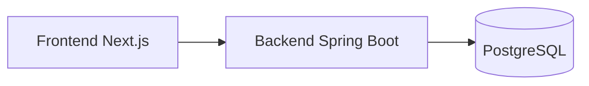

# WebElec SaaS

<div align="center">
  
  <br />
  <h3>Plateforme de gestion et de conformité pour artisans électriciens</h3>
</div>

---

## 🚀 Démarrage rapide

### Option recommandée : Développement local

**Windows** :
```bash
# 1. Démarrer PostgreSQL dans Docker
start-dev.bat

# 2. Backend (nouveau terminal)
cd backend
mvnw spring-boot:run

# 3. Frontend (nouveau terminal)
cd frontend
pnpm dev
```

**Linux/Mac** :
```bash
# 1. Démarrer PostgreSQL
docker-compose up -d postgres pgadmin

# 2. Backend (nouveau terminal)
cd backend
./mvnw spring-boot:run

# 3. Frontend (nouveau terminal)
cd frontend
pnpm dev
```

**Accès** :
- Frontend : http://localhost:3000
- Backend API : http://localhost:8080
- PgAdmin : http://localhost:5050

📖 **Guide complet** : Voir [DEMARRAGE_LOCAL.md](./DEMARRAGE_LOCAL.md)

---

## 🔌 Vue d'ensemble

**WebElec SaaS** est une application professionnelle conçue pour les **électriciens**, **PME techniques** et **bureaux d’étude**.

Objectif clair : **centraliser le métier**, réduire les erreurs terrain et garantir la **conformité réglementaire**.

### Fonctionnalités principales

* Gestion des sociétés
* Clients & chantiers
* Interventions
* Devis & factures
* Pièces justificatives (photos, PDF, tickets…) ✅
* Conformité électrique (RGIE 2025 – Belgique)
* Intégration Peppol (facturation électronique)

---

## 🧱 Architecture générale

* **Frontend** : Next.js + TypeScript
* **Backend** : Spring Boot 3.5 (Java 21)
* **Base de données** : H2 (développement) → PostgreSQL (production)



---

## 🔧 Backend – Spring Boot

Le backend constitue **l’autorité métier et réglementaire** de WebElec.

### Rôle

* API REST
* Validation métier
* Application des règles RGIE
* Authentification et rôles
* Persistance des données

### Pile technique

* Spring Boot **3.5.x**
* Java **21**
* Spring Web / Data JPA / Validation / Security
* PostgreSQL (prod), H2 (dev)
* Lombok

---

## 🚀 Démarrage rapide (Backend)

```bash
./mvnw spring-boot:run
```

Application disponible sur : [http://localhost:8080](http://localhost:8080)

---

## 📡 API REST – Fonctionnalités métier

| Domaine          | Endpoint                | Description           |
| ---------------- | ----------------------- | --------------------- |
| Sociétés         | `/api/societes`         | CRUD + validation TVA |
| Clients          | `/api/clients`          | CRUD + filtre société |
| Chantiers        | `/api/chantiers`        | Suivi technique       |
| Interventions    | `/api/interventions`    | Historique terrain    |
| Produits         | `/api/produits`         | Stock                 |
| Produits avancés | `/api/produits-avances` | Catalogue enrichi     |
| Devis            | `/api/devis`            | Lignes dynamiques     |
| Factures         | `/api/factures`         | Statuts & échéances   |
| Pièces           | `/api/pieces`           | Photos, PDF, tickets  |

👉 Spécification OpenAPI : `src/main/resources/api-spec.yaml`

---

## 📁 Pièces justificatives (`/api/pieces`)

Gestion centralisée des documents liés aux interventions, devis et factures.

* Upload multipart
* Téléchargement sécurisé
* Association intervention / devis / facture
* Stockage configurable (`uploads/`)

---

## 🖥️ Frontend – Next.js

Le frontend est **l’interface utilisateur**, jamais décisionnaire.

### Technologies

* Next.js 15/16 (App Router)
* React 19
* TypeScript strict
* Tailwind CSS
* shadcn/ui

### Rôle

* Authentification utilisateur
* Saisie terrain
* Tableaux de bord
* Affichage des résultats réglementaires

---

## 🚀 Démarrage rapide (Frontend)

```bash
npm install
npm run dev
```

Application disponible sur : [http://localhost:3000](http://localhost:3000)

Variable d’environnement :

```
NEXT_PUBLIC_API_URL=http://localhost:8080/api
```

---

## 🤖 RGIE & IA

### RGIE

* Données RGIE 2025 structurées
* Articles référencés
* Seuils normatifs versionnés
* Aucune logique floue

### IA

* Assistant explicatif uniquement
* Analyse causes → effets
* Suggestions d’actions correctives
* Jamais décisionnaire

---

## 🧭 Principe fondamental

> **Une seule vérité, plusieurs lectures.**

* Le **RGIE** définit les règles
* Le **backend** décide
* L’**IA** explique
* Le **frontend** affiche

---

## 👷 Auteur

**Christophe Seyler**
Électricien – Développeur – IoT – RGIE
Belgique
