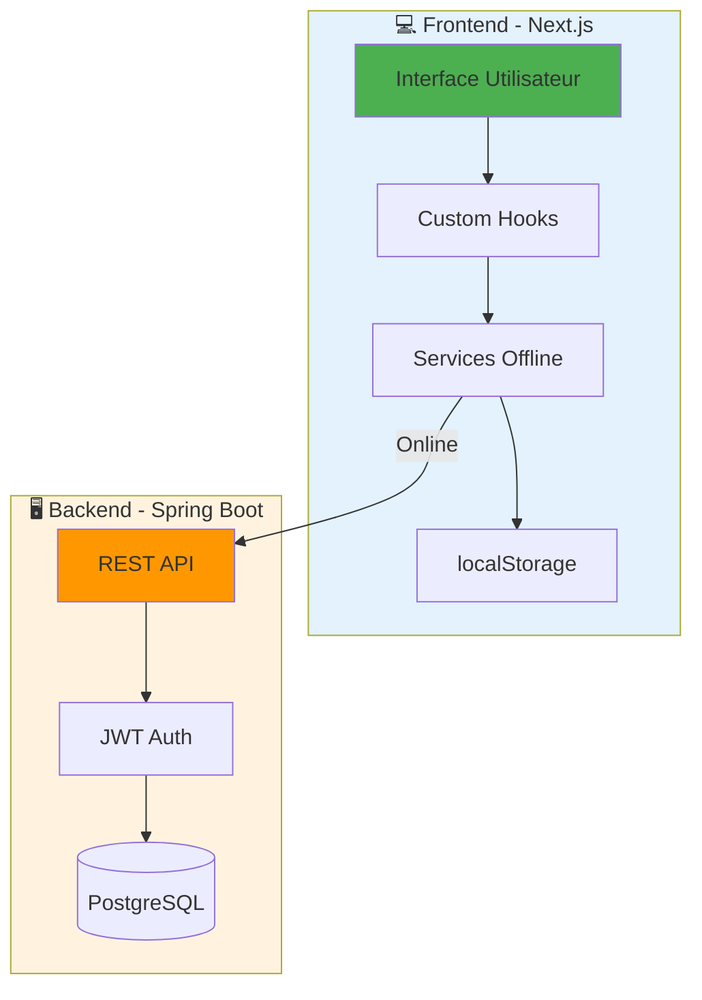
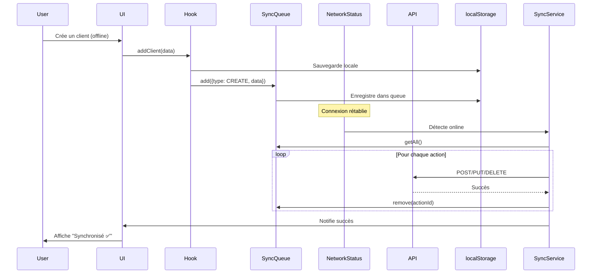
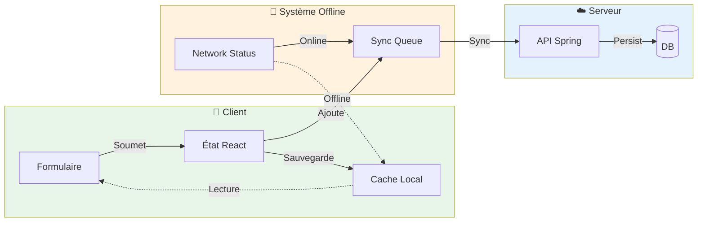
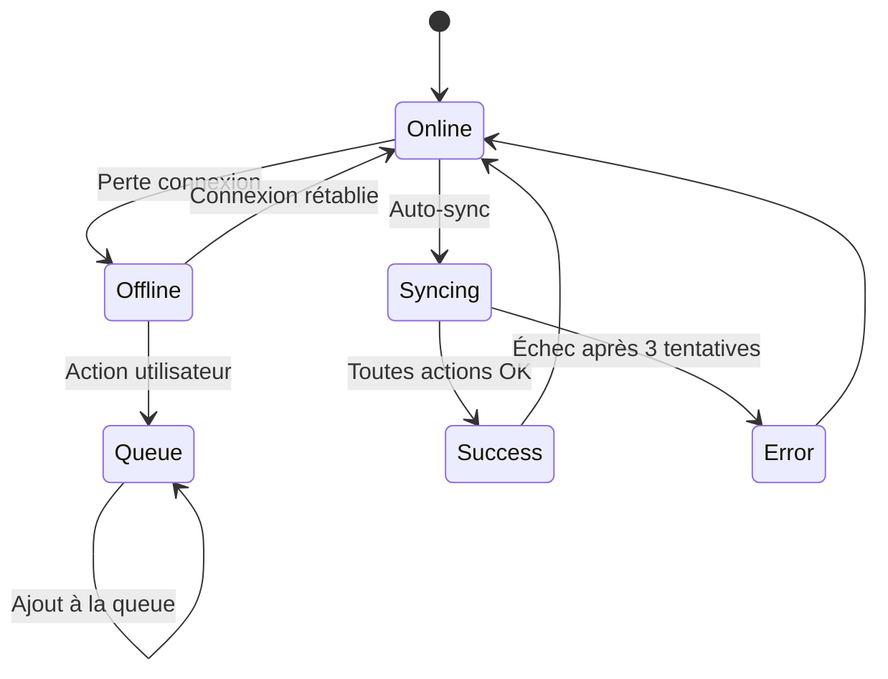
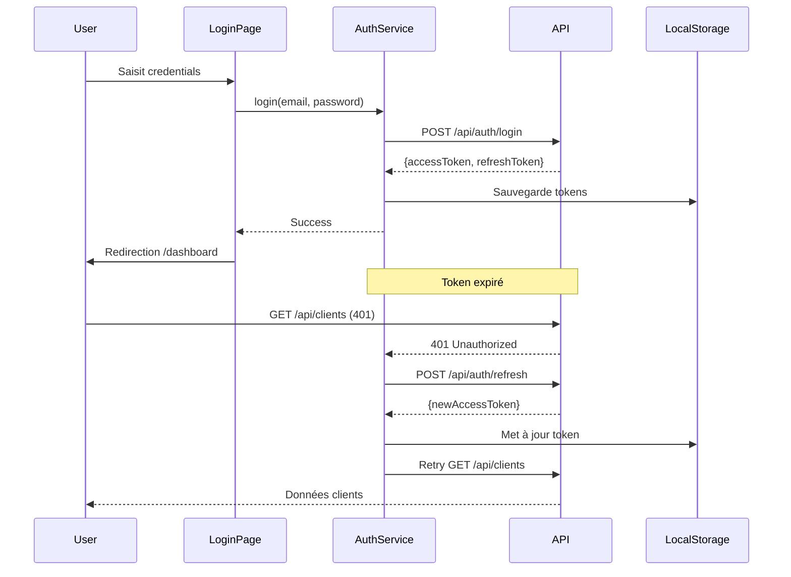

# 📱 WebElec Mobile

Application mobile PWA (Progressive Web App) pour la gestion d'entreprise d'électricité. Interface moderne et réactive avec support du mode hors-ligne complet.


## 🎯 Fonctionnalités

### ✅ Gestion complète
- 👥 **Clients** - CRUD complet avec photos et coordonnées
- 🏗️ **Chantiers** - Gestion avec statuts, planification et suivi
- 📸 **Photos** - Capture d'images via caméra ou galerie
- 🔄 **Synchronisation** - Mode hors-ligne avec queue automatique
- 🎨 **Thèmes** - Mode clair/sombre avec persistance

### 🚀 Caractéristiques techniques
- ⚡ **Next.js 16** avec Turbopack pour des builds ultra-rapides
- 📱 **PWA** - Installable sur mobile et desktop
- 🌐 **Mode offline** - Fonctionne sans connexion internet
- 🔐 **Authentification JWT** avec refresh automatique
- 💾 **localStorage** pour la persistance locale
- 🎯 **TypeScript** strict pour la sécurité du typage

## 📊 Architecture

### Vue d'ensemble du système



### Architecture du mode hors-ligne



### Flux de données



## 🏗️ Structure du projet

```
webelec-mobile/
├── app/                          # Routes Next.js (App Router)
│   ├── chantiers/               # 🏗️ Gestion des chantiers
│   ├── clients/                 # 👥 Gestion des clients
│   ├── dashboard/               # 📊 Tableau de bord
│   ├── login/                   # 🔐 Authentification
│   └── settings/                # ⚙️ Paramètres
├── components/                   # Composants réutilisables
│   ├── forms/                   # Formulaires
│   │   ├── ClientForm.tsx       # Formulaire client
│   │   └── ChantierForm.tsx     # Formulaire chantier
│   ├── mobile/                  # Composants mobiles
│   │   ├── BottomNav.tsx        # Navigation
│   │   └── ThemeStatus.tsx      # Gestion du thème
│   ├── ImagePicker.tsx          # Capture de photos
│   ├── Modal.tsx                # Modale réutilisable
│   └── NetworkStatusIndicator.tsx # Indicateur réseau
├── hooks/                        # Custom React Hooks
│   ├── useClients.ts            # Hook gestion clients
│   ├── useChantiers.ts          # Hook gestion chantiers
│   └── useNetworkStatus.ts      # Hook statut réseau
├── lib/                          # Bibliothèques et services
│   ├── api/                     # Intégration API
│   │   ├── client.ts            # Client Axios
│   │   └── services/            # Services API
│   │       ├── auth.service.ts
│   │       ├── client.service.ts
│   │       └── chantier.service.ts
│   └── offline/                 # Système offline
│       ├── network-status.ts    # Détection réseau
│       ├── sync-queue.ts        # Queue de sync
│       └── sync-service.ts      # Service de sync
├── types/                        # Définitions TypeScript
│   └── index.ts                 # Types Client, Chantier
├── public/                       # Assets statiques
│   ├── manifest.json            # Manifest PWA
│   └── icons/                   # Icônes PWA
└── styles/                       # Styles globaux
    └── globals.css              # CSS avec variables
```

## 🚀 Installation

### Prérequis

- **Node.js** 18.x ou supérieur
- **npm** ou **pnpm**
- **Backend Spring Boot** (voir [webelec-saas](../webelec-saas))

### Configuration

1. **Cloner le repository**
```bash
git clone <repo-url>
cd webelec-mobile
```

2. **Installer les dépendances**
```bash
npm install
# ou
pnpm install
```

3. **Configurer les variables d'environnement**

Créer un fichier `.env.local`:
```env
# URL de l'API Backend Spring Boot
NEXT_PUBLIC_API_URL=http://localhost:8080

# Configuration PWA
NEXT_PUBLIC_APP_NAME=WebElec
NEXT_PUBLIC_APP_SHORT_NAME=WebElec
```

4. **Lancer le serveur de développement**
```bash
npm run dev
```

L'application sera disponible sur [http://localhost:3000](http://localhost:3000)

## 🔧 Scripts disponibles

```bash
npm run dev          # Démarrage en mode développement (Turbopack)
npm run build        # Build de production
npm run start        # Démarrage du serveur de production
npm run lint         # Vérification ESLint
npm run type-check   # Vérification TypeScript
```

## 📱 Mode PWA

### Installation

L'application peut être installée sur n'importe quel appareil:

**Sur mobile (iOS/Android):**
1. Ouvrir dans Safari/Chrome
2. Menu → "Ajouter à l'écran d'accueil"

**Sur desktop:**
1. Icône d'installation dans la barre d'URL
2. Ou Menu → "Installer WebElec"

### Fonctionnalités PWA

- ✅ Installation sur écran d'accueil
- ✅ Lancement en plein écran
- ✅ Mode hors-ligne complet
- ✅ Icônes adaptatives
- ✅ Splash screens

## 🌐 Mode Hors-Ligne

### Fonctionnement



### Actions supportées en mode offline

| Action | Entité | Support |
|--------|--------|---------|
| CREATE | Client | ✅ |
| UPDATE | Client | ✅ |
| DELETE | Client | ✅ |
| CREATE | Chantier | ✅ |
| UPDATE | Chantier | ✅ |
| DELETE | Chantier | ✅ |
| Photos | Base64 | ✅ |

### API de la queue de synchronisation

```typescript
import { syncQueue } from '@/lib/offline';

// Ajouter une action
syncQueue.add({
  type: 'CREATE',
  entity: 'client',
  data: { nom: 'Dupont', prenom: 'Jean' } as unknown as Record<string, unknown>
});

// Obtenir le nombre d'actions en attente
const count = syncQueue.size();

// Forcer la synchronisation
await syncService.forceSyncNow();
```

## 🔐 Authentification

### Flux d'authentification JWT



### Gestion des tokens

- **Access Token** : Stocké dans localStorage, durée 15 min
- **Refresh Token** : Stocké dans localStorage, durée 7 jours
- **Auto-refresh** : Automatique sur erreur 401
- **Déconnexion** : Suppression des tokens

## 🎨 Thèmes

L'application supporte deux thèmes avec persistance:

### Variables CSS

```css
/* Mode Clair */
--background: 0 0% 100%;
--foreground: 222.2 84% 4.9%;
--surface: 0 0% 98%;

/* Mode Sombre */
--background: 222.2 84% 4.9%;
--foreground: 210 40% 98%;
--surface: 217.2 32.6% 17.5%;
```

### Utilisation

```tsx
import { useTheme } from '@/lib/theme-context';

const { theme, toggleTheme } = useTheme();
// theme: 'light' | 'dark'
```

## 📡 Intégration API

### Configuration du client

```typescript
// lib/api/client.ts
import { ApiClient } from '@/lib/api/client';

const apiClient = new ApiClient(
  process.env.NEXT_PUBLIC_API_URL || 'http://localhost:8080'
);

// Auto-injection des tokens JWT
// Auto-refresh sur 401
```

### Services disponibles

```typescript
import { authService, clientService, chantierService } from '@/lib/api';

// Authentification
await authService.login({ email, password });
await authService.logout();

// Clients
const clients = await clientService.getAll();
const client = await clientService.getById(id);
await clientService.create(data);
await clientService.update(id, data);
await clientService.delete(id);

// Chantiers
const chantiers = await chantierService.getAll();
const chantier = await chantierService.getById(id);
await chantierService.create(data);
await chantierService.update(id, data);
await chantierService.delete(id);
```

## 🧩 Composants principaux

### Modal

Modal réutilisable avec différentes tailles:

```tsx
<Modal
  isOpen={showModal}
  onClose={handleClose}
  title="Titre du modal"
  maxWidth="xl"
>
  <p>Contenu du modal</p>
</Modal>
```

### ImagePicker

Capture de photos avec support caméra et galerie:

```tsx
<ImagePicker
  image={photo}
  onChange={(base64) => setPhoto(base64)}
  label="Photo du chantier"
/>
```

### NetworkStatusIndicator

Indicateur automatique du statut réseau et de synchronisation:

```tsx
<NetworkStatusIndicator />
```

Affiche automatiquement:
- 🔴 Mode hors-ligne
- 🔵 Synchronisation en cours
- 🟢 Synchronisé
- 🔴 Erreur de synchronisation

## 📊 Types TypeScript

### Client

```typescript
interface Client {
  id: string;
  name: string;
  contact: string;
  phone?: string;
  email?: string;
  address?: string;
  city: string;
  postalCode?: string;
  photo?: string;  // Base64
  notes?: string;
  createdAt: string;
  updatedAt: string;
}
```

### Chantier

```typescript
interface Chantier {
  id: string;
  title: string;
  clientId: string;
  clientName?: string;
  address: string;
  city: string;
  postalCode?: string;
  status: "A demarrer" | "En cours" | "Controle final" | "Termine" | "Suspendu";
  startDate?: string;
  endDate?: string;
  description?: string;
  photo?: string;  // Base64
  notes?: string;
  createdAt: string;
  updatedAt: string;
}
```

## 🧪 Tests

```bash
# Tests unitaires (à venir)
npm run test

# Tests E2E (à venir)
npm run test:e2e

# Coverage
npm run test:coverage
```

## 🔍 Débogage du mode offline

### Console logs

Le système affiche des logs détaillés:

```
📝 Action ajoutée à la queue: CREATE client
🔄 Début de la synchronisation de 3 action(s)
🔄 Traitement de l'action: CREATE client
✅ Action supprimée de la queue: 1234567890-abc123
✅ Synchronisation terminée: 3 succès, 0 erreurs
```

### Inspection de la queue

Dans la console du navigateur:

```javascript
// Voir la queue
localStorage.getItem('webelec_sync_queue')

// Forcer une synchronisation
import { syncService } from '@/lib/offline';
await syncService.forceSyncNow();

// Vider la queue
import { syncQueue } from '@/lib/offline';
syncQueue.clear();
```

### Simuler le mode offline

**Chrome DevTools:**
1. F12 → Onglet Network
2. Throttling → "Offline"

**Mobile:**
1. Mode avion
2. Désactiver WiFi

## 🚀 Déploiement

### Vercel (recommandé)

```bash
# Installation de Vercel CLI
npm i -g vercel

# Déploiement
vercel
```

### Docker

```dockerfile
FROM node:18-alpine
WORKDIR /app
COPY package*.json ./
RUN npm ci
COPY . .
RUN npm run build
EXPOSE 3000
CMD ["npm", "start"]
```

```bash
docker build -t webelec-mobile .
docker run -p 3000:3000 webelec-mobile
```

### Build optimisé

```bash
npm run build
npm run start
```

## 📈 Performance

- ⚡ **First Contentful Paint** < 1s
- 🎯 **Time to Interactive** < 2s
- 📦 **Bundle size** < 200KB (gzipped)
- 🔄 **Code splitting** automatique par route
- 🖼️ **Images** optimisées avec Next.js Image

## 🛠️ Technologies utilisées

| Technologie | Version | Usage |
|-------------|---------|-------|
| Next.js | 16.1.6 | Framework React |
| TypeScript | 5.x | Typage statique |
| Tailwind CSS | 3.x | Styling |
| Axios | 1.x | Client HTTP |
| React | 19.x | UI Library |
| PWA | - | Progressive Web App |

## 📝 Documentation complémentaire

- [OFFLINE_MODE.md](./OFFLINE_MODE.md) - Documentation détaillée du mode hors-ligne
- [API_INTEGRATION.md](./API_INTEGRATION.md) - Guide d'intégration API
- [Spring Boot Backend](../webelec-saas/backend) - Documentation du backend

## 🤝 Contribution

### Guidelines

1. Fork le projet
2. Créer une branche (`git checkout -b feature/AmazingFeature`)
3. Commit les changements (`git commit -m 'Add: AmazingFeature'`)
4. Push vers la branche (`git push origin feature/AmazingFeature`)
5. Ouvrir une Pull Request

### Conventions

- **Commits** : Convention [Conventional Commits](https://www.conventionalcommits.org/)
- **Code** : ESLint + Prettier
- **Types** : TypeScript strict mode
- **Tests** : Coverage minimum 80%

## 📄 Licence

Ce projet est sous licence MIT. Voir le fichier [LICENSE](./LICENSE) pour plus de détails.

## 👥 Équipe

Développé avec ❤️ par l'équipe WebElec

## 📞 Support

- 📧 Email: support@webelec.com
- 💬 Discord: [WebElec Community](https://discord.gg/webelec)
- 📚 Docs: [docs.webelec.com](https://docs.webelec.com)

---

**Version**: 1.0.0
**Dernière mise à jour**: 2026-02-12

Made with 💙 using Next.js and TypeScript
