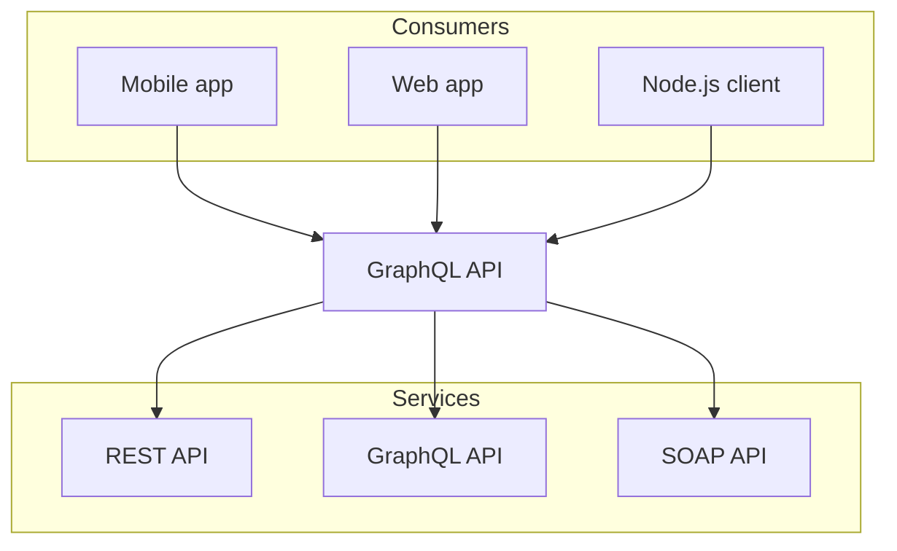
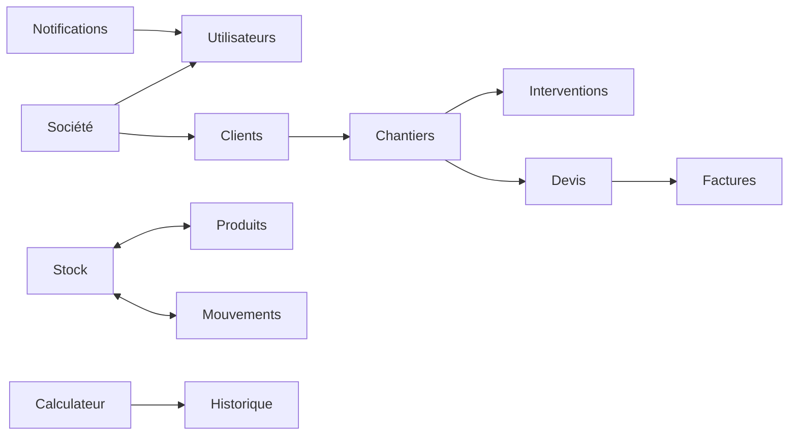

# WebElec SaaS

Plateforme de gestion et de conformite pour electriciens. WebElec combine un frontend moderne, une API Spring Boot et une base PostgreSQL pour couvrir le cycle terrain -> administratif.

## Sommaire
- Vue d'ensemble
- Fonctionnalites
- Stack technique
- Architecture – Beta
- Modèle fonctionnel / métier
- Démarrage rapide
- Documentation
- Depannage rapide
- Remarques franches (et utiles)

## Vue d'ensemble
WebElec centralise la gestion des societes, clients, chantiers, devis, factures, stock et interventions. Le calculateur RGIE et les documents legaux sont integres a l'API pour faciliter la conformite.

## Fonctionnalites
- Gestion multi-societe et roles utilisateur
- Clients, chantiers, interventions
- Devis et facturation
- Stock, produits et mouvements
- Calculateur electrique avec historique
- Documents legaux et notifications
- API REST securisee (JWT)

## Stack technique
- Frontend : Next.js + TypeScript
- Backend : Spring Boot 3.5 (Java 21)
- Base de donnees : PostgreSQL 16
- Infra locale : Docker Compose

## Architecture – Beta


## Modèle fonctionnel / métier



## Démarrage rapide

1. L'utilisateur accède au Frontend (Next.js)
2. Le Frontend communique avec l'API Backend (Spring Boot)
3. Le Backend persiste les données dans PostgreSQL
4. L'administration de la base se fait via PgAdmin

Demarrer la base et le backend en Docker :

```bash
docker compose up -d postgres pgadmin backend
```

Lancer le frontend en local :

```bash
cd frontend
pnpm install
pnpm dev
```

## Acces
- Frontend : http://localhost:3000
- Backend API : http://localhost:8080
- PgAdmin : http://localhost:5050

## Documentation
- `docs/README.md` (index)
- `docs/setup-local.md`
- `docs/docker.md`
- `docs/env.md`
- `docs/tests.md`
- `docs/deployment-backend.md`
- `docs/user-guide.md`
- `backend/README.md`
- `frontend/README.md`
- `backend/src/main/resources/api-spec.yaml`

## Depannage rapide

Backend modifie mais pas de changement :

```bash
docker compose build backend
docker compose up -d backend
```

Frontend : variables d'environnement non prises en compte :

```bash
# Arreter (Ctrl+C) puis relancer
pnpm dev
```

## Contribution

Pour contribuer au projet :
1. Créer une branche depuis `main`
2. Effectuer vos modifications
3. Tester localement avec `docker compose` et `pnpm dev`
4. Soumettre une pull request avec une description claire

## Support

Pour toute question ou problème :
- Consulter la documentation dans `/docs`
- Vérifier les issues GitHub existantes
- Créer une nouvelle issue si nécessaire


  mvnw.cmd spring-boot:run -Dspring-boot.run.profiles=dev
