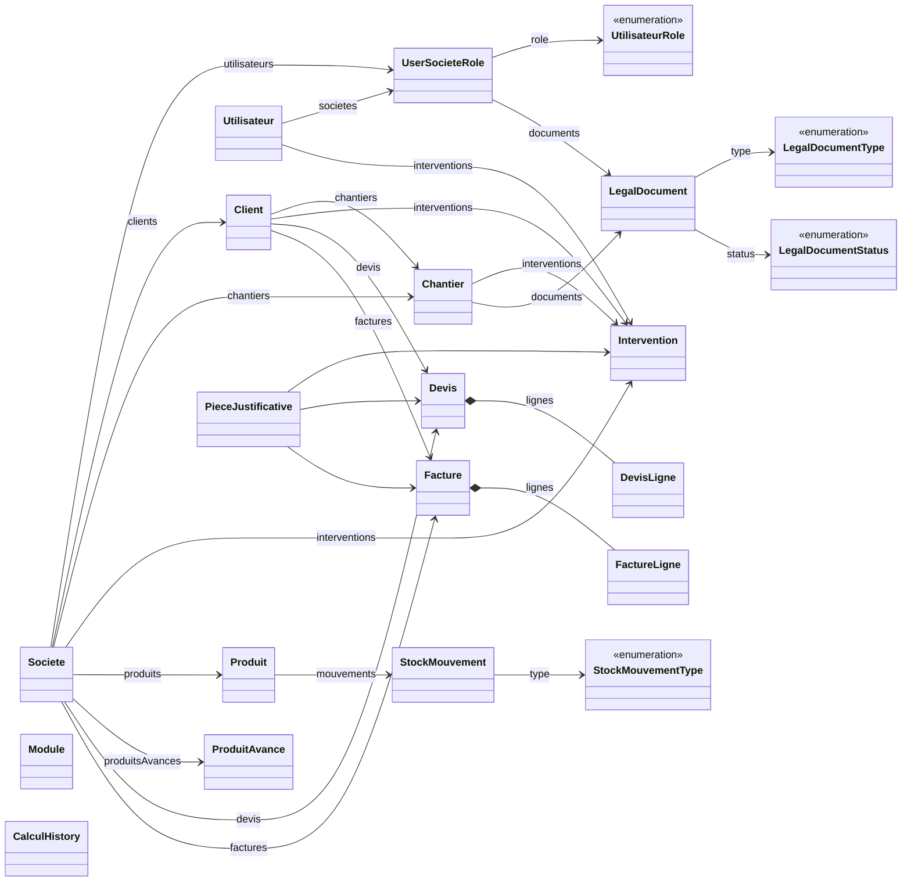
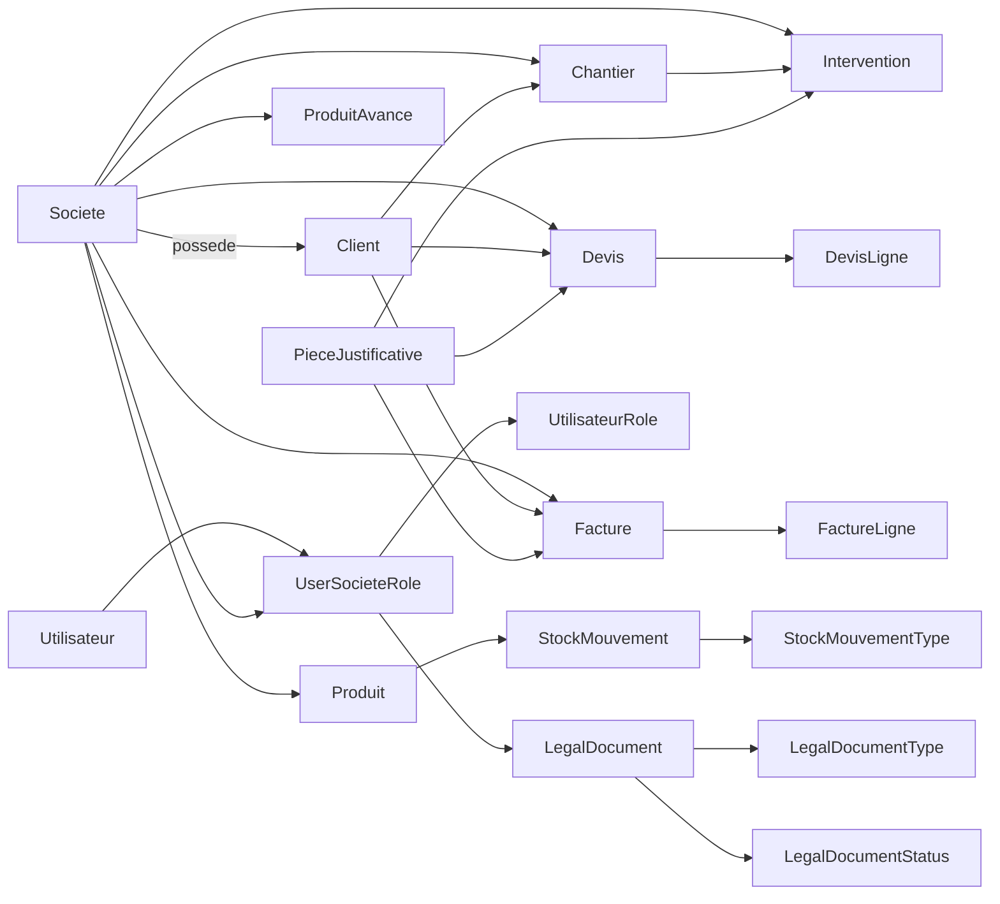
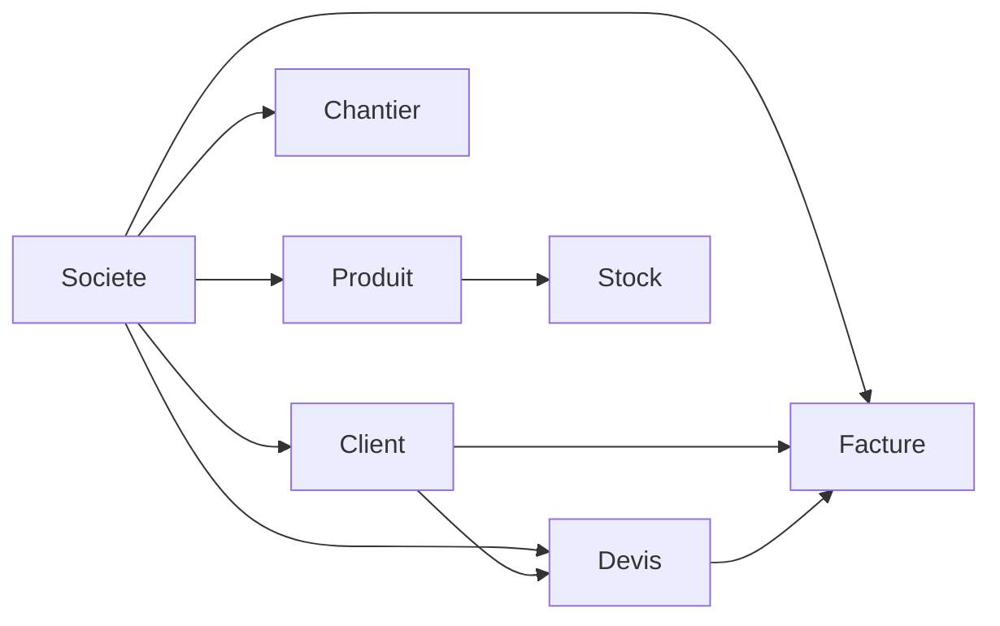
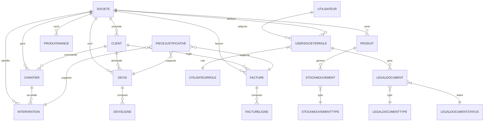
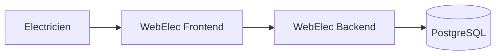
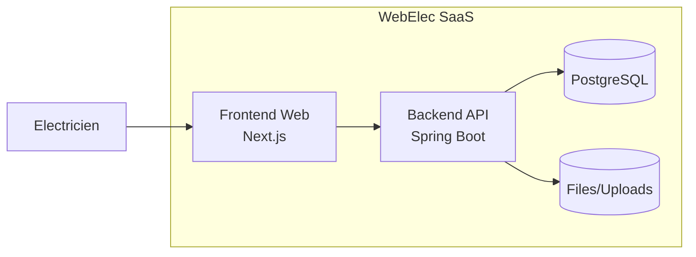
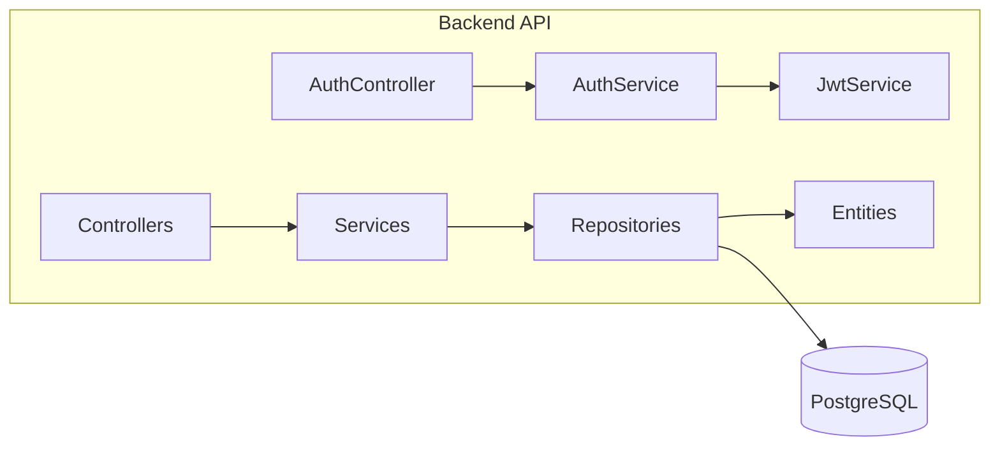
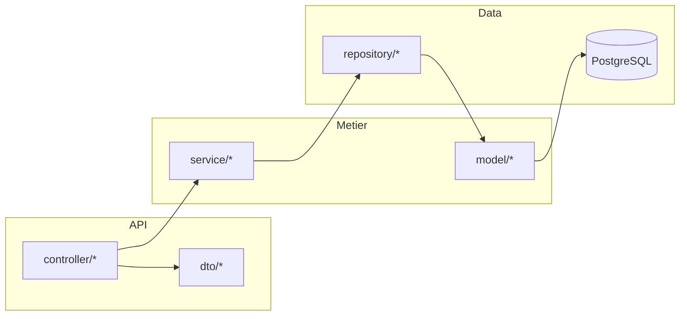
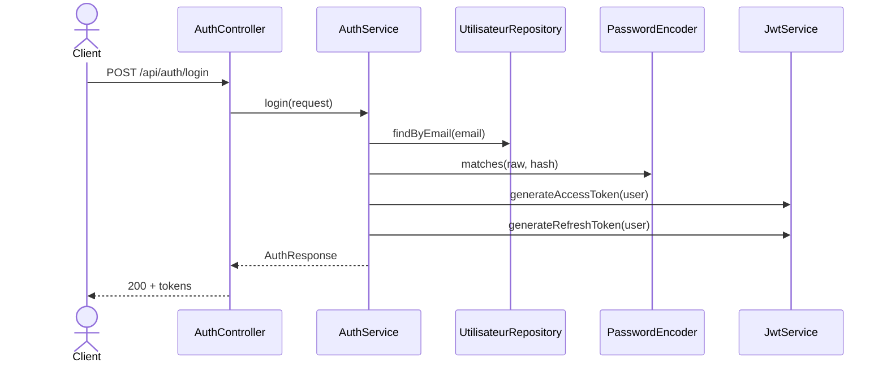

# Backend diagrams (Mermaid)

These diagrams are based on the current Java packages under
`backend/src/main/java/com/webelec/backend`.

## Class diagram (domain model)

## Synthèse relationnelle (Mermaid)

## Graph simplifie (Mermaid)

## Diagramme entite-relation (Mermaid)

## System context (C4-style, Mermaid)

## Containers (C4-style, Mermaid)

## Components (C4-style, Mermaid)

## DTOs -> Controllers (API)

```mermaid
flowchart LR
  subgraph Controllers
    AuthController
    CalculateurController
    ChantierController
    ClientController
    DevisController
    FactureController
    InterventionController
    LegalDocumentController
    ModuleController
    PieceJustificativeController
    ProduitAvanceController
    ProduitController
    SocieteController
    StockController
    UtilisateurController
  end

  subgraph DTOs
    AuthLoginRequest
    AuthRefreshRequest
    AuthRegisterRequest
    AuthResponse
    UtilisateurResponse
    CalculHistoryCreateDTO
    CalculHistoryDTO
    CalculateurPreferencesDTO
    ChantierRequest
    ChantierResponse
    ClientRequest
    ClientResponse
    DevisRequest
    DevisResponse
    FactureImportResponse
    FactureRequest
    FactureResponse
    PeppolResultDTO
    UblDTO
    InterventionRequest
    InterventionResponse
    LegalDocumentReadyRequest
    LegalDocumentSignRequest
    ModuleRequest
    ModuleResponse
    ModuleUpdateRequest
    PieceJustificativeResponse
    ProduitAvanceRequest
    ProduitAvanceResponse
    ProduitRequest
    ProduitResponse
    SocieteRequest
    SocieteResponse
    StockMouvementRequest
    StockMouvementResponse
    UtilisateurRequest
  end

  AuthController --> AuthLoginRequest
  AuthController --> AuthRefreshRequest
  AuthController --> AuthRegisterRequest
  AuthController --> AuthResponse
  AuthController --> UtilisateurResponse

  CalculateurController --> CalculHistoryCreateDTO
  CalculateurController --> CalculHistoryDTO
  CalculateurController --> CalculateurPreferencesDTO

  ChantierController --> ChantierRequest
  ChantierController --> ChantierResponse

  ClientController --> ClientRequest
  ClientController --> ClientResponse

  DevisController --> DevisRequest
  DevisController --> DevisResponse

  FactureController --> FactureImportResponse
  FactureController --> FactureRequest
  FactureController --> FactureResponse
  FactureController --> PeppolResultDTO
  FactureController --> UblDTO

  InterventionController --> InterventionRequest
  InterventionController --> InterventionResponse

  LegalDocumentController --> LegalDocumentReadyRequest
  LegalDocumentController --> LegalDocumentSignRequest

  ModuleController --> ModuleRequest
  ModuleController --> ModuleResponse
  ModuleController --> ModuleUpdateRequest

  PieceJustificativeController --> PieceJustificativeResponse

  ProduitAvanceController --> ProduitAvanceRequest
  ProduitAvanceController --> ProduitAvanceResponse

  ProduitController --> ProduitRequest
  ProduitController --> ProduitResponse

  SocieteController --> SocieteRequest
  SocieteController --> SocieteResponse

  StockController --> StockMouvementRequest
  StockController --> StockMouvementResponse

  UtilisateurController --> UtilisateurRequest
  UtilisateurController --> UtilisateurResponse
```

## Architecture graph (layers)

## Sequence graph (auth login)

## Annexe – Graphe Client (Mermaid)

