# WebElec SaaS – Developer Documentation (README.dev.md)

Documentation technique destinée aux développeurs, DevOps et contributeurs.
Ce document décrit l’architecture interne, les choix techniques, les conventions
et les règles à respecter pour garantir la stabilité du SaaS WebElec.

---

## 1. Principes d’architecture

### 1.1 Séparation stricte des responsabilités

- Spring Boot = backend métier (source de vérité)
- Next.js = frontend UI + orchestration
- Aucune logique métier persistante côté Next.js
- Aucun mock métier en production

Cette séparation est volontaire et non négociable.

---

## 2. Architecture globale

Client (Browser)
↓
Next.js (Frontend)
↓
Spring Boot (API REST)
↓
PostgreSQL

Next.js ne parle jamais directement à la base de données.

---

## 3. Backend – Spring Boot

### 3.1 Stack technique

- Java 21
- Spring Boot 3.x
- Spring Security (JWT)
- JPA / Hibernate
- PostgreSQL
- Maven
- Docker

### 3.2 Rôles backend

- Gestion des entités métier
- Validation des règles
- Sécurité (authentification + autorisation)
- Conformité RGIE
- Calculs et cohérence des données

### 3.3 Endpoints REST (statuts/erreurs attendus)

- 200/201 : payload JSON métier
- 400 : validation (message + `details` optionnels)
- 401 : JWT manquant/expiré
- 403 : rôle insuffisant (`ADMIN`/`GERANT`/`TECHNICIEN`)
- 404 : ressource absente
- 409 : conflit (numéro devis/facture déjà utilisé)
- 422 : données incohérentes métier
- 500/502/504 : erreur serveur/proxy

Tous les endpoints métier sont servis par Spring Boot.

---

## 4. Frontend – Next.js

### 4.1 Stack technique

- Next.js (App Router)
- TypeScript
- Tailwind CSS
- Fetch API
- Docker

### 4.2 Règle fondamentale

Le frontend refuse de démarrer sans URL backend explicite. Valeurs recommandées :

- Dév : `NEXT_PUBLIC_API_BASE=http://localhost:8080/api`
- Prod : `NEXT_PUBLIC_API_BASE=https://api.webelec.be/api` (à adapter à votre déploiement)

Comportement :

- Pas de fallback vers `/api` ou vers une valeur par défaut.
- Le code lève une erreur tôt si la variable est absente (voir `lib/api/base.ts`).
- Pour toute exécution Docker/CI, injectez explicitement `NEXT_PUBLIC_API_BASE` au build/run.

Exemple `.env.example` :

```md
NEXT_PUBLIC_API_BASE="http://localhost:8080/api" # Dev backend (Spring Boot)

# NEXT_PUBLIC_API_BASE="https://api.webelec.be/api" # Prod backend URL

# Legacy alias (à supprimer dès migration complète) :

# NEXT_PUBLIC_API_URL="http://localhost:8080/api"

OPENAI_API_KEY="sk-xxxx"
WEBELEC_JWT_SECRET="dev-webelec-secret-change-me-please-0123456789"
```

### 4.3 Identifiants de test (backend Spring)

Le backend seedé via `DataSeeder` crée automatiquement plusieurs utilisateurs sur la base locale. Le compte administrateur par défaut est :

- Email : `admin@webelec.fr`
- Mot de passe : `Admin@12345`

Connectez-vous via `/login` côté frontend, ou directement sur `/api/auth/login`. D’autres comptes existent (Laura/Hugo/Clara/Nabil – mot de passe `demo123!`). Dès que vous créez vos propres utilisateurs via `/api/auth/register`, pensez à mettre à jour cette section si nécessaire.

---

## 5. Organisation du frontend

frontend/
├─ app/
│ ├─ api/ # routes proxy ou frontend spécifiques
│ ├─ dashboard/
│ ├─ societes/
│ ├─ clients/
│ ├─ chantiers/
│ └─ ...
│
├─ lib/
│ └─ api/
│ └─ base.ts # configuration API backend (strict)
│
├─ public/
├─ package.json
└─ Dockerfile

---

## 6. Règles sur app/api

### 6.1 Ce qui est autorisé

- Proxy explicite vers le backend Spring
- Auth frontend (login/logout/me)
- Upload temporaire (fichiers, images)
- Cas UI spécifiques sans logique métier

### 6.2 Ce qui est interdit

- CRUD métier réel
- Accès base de données
- Mocks en production
- Logique RGIE côté Next.js

---

## 7. Proxy API (pattern officiel)

### 7.1 Utilitaire proxy

app/api/proxy.ts

- Signature : `proxyApi(req: NextRequest, path: string): Promise<NextResponse>`
- Construction d’URL : concatène `NEXT_PUBLIC_API_BASE` + `path` + querystring
- Headers : recopie des headers entrants (Host/Connection supprimés)
- Corps : pass-through sauf GET/HEAD
- Timeout : 10s via `AbortController`
- Erreurs : 504 si timeout, 502 sinon, payload `{ error: message }`
- Cache : `no-store`

### 7.2 Exemple de route proxy

app/api/factures/route.ts

```ts
import { proxyApi } from "../proxy";
import { NextRequest } from "next/server";

export async function GET(req: NextRequest) {
  return proxyApi(req, "/factures");
}

export async function POST(req: NextRequest) {
  return proxyApi(req, "/factures");
}
```

---

## 8. Gestion des mocks

- Emplacement : `lib/mocks/`
- Activation : uniquement si `NODE_ENV !== "production"`
- Interdiction : aucun mock servi en prod (condition explicite dans chaque route)
- Usage : démo/maquette uniquement; la logique métier reste côté backend

---

## 9. Sécurité / séparation serveur-client

- Calculs RGIE/TVA/Peppol et validations métier côté backend uniquement
- Front = UI + orchestration; pas de règles critiques ni de secrets côté client
- Opérations sensibles (devis, factures, stock) : Server Actions ou routes API côté serveur, jamais en client
- JWT backend : durée courte (ex : 15 min) + refresh token côté Spring; vérifications rôles (`ADMIN`, `GERANT`, `TECHNICIEN`) dans les contrôleurs
- Limitations front : aucun stockage de données sensibles (pas de clés IoT/MQTT, pas de secrets API), simple portage du JWT côté navigateur

---

## 10. Tests et qualité

- Emplacement des tests : `**/*.test.ts`
- Commandes :
  - `npm test` (Jest)
  - `npm run lint` (ESLint)
  - `npm run format` ou `npx prettier --check .`
- Règles : pas de warnings volontaires, typage strict, mocks interdits en prod, tester la logique utilitaire

---

## 11. Bonnes pratiques obligatoires

- Pas de fallback silencieux
- Pas de logique dupliquée
- Pas de mock caché
- Les erreurs doivent casser tôt
- Toute règle métier appartient au backend

---

## 12. Évolution prévue

- RGIE avancé (audit automatique)
- Assistant IA (RAG / MCP)
- Multi-métiers (chauffage, HVAC)
- Facturation électronique (Peppol)
- Dashboards techniques et décisionnels

---

## 13. État du projet

- Architecture validée
- Backend opérationnel
- Frontend connecté au backend réel
- Base saine pour un SaaS long terme

---

## 14. Auteur

Christophe Seyler  
Électricien – Développeur – IoT – Bureau d’étude

---

## 15. Notes finales

Ce document fait partie intégrante du projet.
Toute modification architecturale doit être cohérente avec ce README.dev.md.

## bdd


```sql
-- =========================
-- TABLE : societes
-- =========================
-- Racine du SaaS.
-- Une société = un périmètre de données totalement isolé.
-- Toutes les autres tables y sont rattachées.
CREATE TABLE societes (
  id BIGSERIAL PRIMARY KEY,              -- Identifiant technique unique
  nom VARCHAR(255) NOT NULL,             -- Nom commercial de la société
  tva VARCHAR(32) NOT NULL,              -- Numéro de TVA (clé légale)
  email VARCHAR(255),                    -- Email de contact
  telephone VARCHAR(32),                 -- Téléphone principal
  adresse VARCHAR(255),                  -- Adresse du siège
  created_at TIMESTAMP DEFAULT now()     -- Date de création
);

-- =========================
-- TABLE : utilisateurs
-- =========================
-- Représente une personne (login).
-- Ne contient PAS de notion d’entreprise directement.
-- Le lien se fait via user_societes.
CREATE TABLE utilisateurs (
  id BIGSERIAL PRIMARY KEY,              -- Identifiant utilisateur
  nom VARCHAR(255),                      -- Nom de famille
  prenom VARCHAR(255),                   -- Prénom
  email VARCHAR(255) NOT NULL UNIQUE,    -- Identifiant de connexion
  mot_de_passe VARCHAR(255),             -- Mot de passe hashé
  created_at TIMESTAMP DEFAULT now()     -- Date de création du compte
);

-- =========================
-- TABLE : user_societes
-- =========================
-- Table CLÉ du modèle multi-entreprises.
-- Définit :
--  - à quelles sociétés appartient un utilisateur
--  - avec quel rôle
CREATE TABLE user_societes (
  user_id BIGINT NOT NULL,               -- Référence utilisateur
  societe_id BIGINT NOT NULL,            -- Référence société
  role VARCHAR(50) NOT NULL,             -- Rôle dans la société (ADMIN, GERANT, TECHNICIEN)
  PRIMARY KEY (user_id, societe_id),     -- Un rôle par couple user/société
  CONSTRAINT fk_us_user
    FOREIGN KEY (user_id) REFERENCES utilisateurs(id) ON DELETE CASCADE,
  CONSTRAINT fk_us_societe
    FOREIGN KEY (societe_id) REFERENCES societes(id) ON DELETE CASCADE
);

-- =========================
-- TABLE : clients
-- =========================
-- Clients commerciaux d’une société.
-- Un même client peut exister dans plusieurs sociétés (isolation SaaS).
CREATE TABLE clients (
  id BIGSERIAL PRIMARY KEY,              -- Identifiant client
  societe_id BIGINT NOT NULL,            -- Société propriétaire du client
  nom VARCHAR(255) NOT NULL,             -- Nom
  prenom VARCHAR(255),                   -- Prénom (optionnel)
  email VARCHAR(255),                    -- Email client
  telephone VARCHAR(32),                 -- Téléphone
  adresse VARCHAR(512),                  -- Adresse complète
  CONSTRAINT fk_client_societe
    FOREIGN KEY (societe_id) REFERENCES societes(id)
);

-- =========================
-- TABLE : chantiers
-- =========================
-- Représente un chantier / projet.
-- Toujours lié à UNE société et UN client.
CREATE TABLE chantiers (
  id BIGSERIAL PRIMARY KEY,              -- Identifiant chantier
  societe_id BIGINT NOT NULL,            -- Société responsable
  client_id BIGINT NOT NULL,             -- Client concerné
  nom VARCHAR(255) NOT NULL,             -- Nom du chantier
  adresse VARCHAR(512),                  -- Adresse d’exécution
  description VARCHAR(1024),             -- Détails techniques
  statut VARCHAR(30),                    -- EN_COURS, TERMINE
  CONSTRAINT fk_chantier_societe
    FOREIGN KEY (societe_id) REFERENCES societes(id),
  CONSTRAINT fk_chantier_client
    FOREIGN KEY (client_id) REFERENCES clients(id)
);

-- =========================
-- TABLE : interventions
-- =========================
-- Action terrain effectuée sur un chantier.
-- Réalisée par un utilisateur, pour une société donnée.
CREATE TABLE interventions (
  id BIGSERIAL PRIMARY KEY,              -- Identifiant intervention
  societe_id BIGINT NOT NULL,            -- Société de rattachement
  chantier_id BIGINT NOT NULL,           -- Chantier concerné
  utilisateur_id BIGINT NOT NULL,        -- Technicien / intervenant
  titre VARCHAR(255) NOT NULL,           -- Intitulé court
  description VARCHAR(1024),             -- Compte rendu
  date_intervention DATE,                -- Date de réalisation
  CONSTRAINT fk_intervention_societe
    FOREIGN KEY (societe_id) REFERENCES societes(id),
  CONSTRAINT fk_intervention_chantier
    FOREIGN KEY (chantier_id) REFERENCES chantiers(id),
  CONSTRAINT fk_intervention_user
    FOREIGN KEY (utilisateur_id) REFERENCES utilisateurs(id)
);

-- =========================
-- TABLE : produits
-- =========================
-- Catalogue produit / stock propre à chaque société.
CREATE TABLE produits (
  id BIGSERIAL PRIMARY KEY,              -- Identifiant produit
  societe_id BIGINT NOT NULL,            -- Société propriétaire
  reference VARCHAR(255) NOT NULL UNIQUE,-- Référence interne
  nom VARCHAR(255) NOT NULL,             -- Nom du produit
  description VARCHAR(1024),             -- Description
  quantite_stock INTEGER,                -- Stock disponible
  prix_achat NUMERIC(12,2),              -- Prix d’achat
  prix_vente NUMERIC(12,2),              -- Prix de vente
  CONSTRAINT fk_produit_societe
    FOREIGN KEY (societe_id) REFERENCES societes(id)
);

-- =========================
-- TABLE : devis
-- =========================
-- Proposition commerciale.
CREATE TABLE devis (
  id BIGSERIAL PRIMARY KEY,              -- Identifiant devis
  societe_id BIGINT NOT NULL,            -- Société émettrice
  client_id BIGINT NOT NULL,             -- Client
  numero VARCHAR(255) UNIQUE,            -- Numéro devis
  date_emission DATE,                    -- Date d’émission
  statut VARCHAR(30),                    -- BROUILLON, ENVOYE, ACCEPTE
  montant_ht NUMERIC(12,2),              -- Total HT
  montant_tva NUMERIC(12,2),             -- TVA
  montant_ttc NUMERIC(12,2),             -- Total TTC
  CONSTRAINT fk_devis_societe
    FOREIGN KEY (societe_id) REFERENCES societes(id),
  CONSTRAINT fk_devis_client
    FOREIGN KEY (client_id) REFERENCES clients(id)
);

-- =========================
-- TABLE : devis_lignes
-- =========================
-- Détail ligne par ligne d’un devis.
CREATE TABLE devis_lignes (
  id BIGSERIAL PRIMARY KEY,              -- Identifiant ligne
  devis_id BIGINT NOT NULL,              -- Devis parent
  description VARCHAR(1024),             -- Description ligne
  quantite INTEGER,                      -- Quantité
  prix_unitaire NUMERIC(12,2),           -- Prix unitaire
  total NUMERIC(12,2),                   -- Total ligne
  CONSTRAINT fk_devis_ligne
    FOREIGN KEY (devis_id) REFERENCES devis(id) ON DELETE CASCADE
);

-- =========================
-- TABLE : factures
-- =========================
-- Facturation (peut venir d’un devis).
CREATE TABLE factures (
  id BIGSERIAL PRIMARY KEY,              -- Identifiant facture
  societe_id BIGINT NOT NULL,            -- Société facturante
  client_id BIGINT NOT NULL,             -- Client
  numero VARCHAR(255) UNIQUE,            -- Numéro facture
  date_emission DATE,                    -- Date émission
  date_echeance DATE,                    -- Date échéance
  statut VARCHAR(30),                    -- PAYEE, EN_ATTENTE
  montant_ht NUMERIC(12,2),              -- HT
  montant_tva NUMERIC(12,2),             -- TVA
  montant_ttc NUMERIC(12,2),             -- TTC
  peppol_status VARCHAR(30),             -- État Peppol
  CONSTRAINT fk_facture_societe
    FOREIGN KEY (societe_id) REFERENCES societes(id),
  CONSTRAINT fk_facture_client
    FOREIGN KEY (client_id) REFERENCES clients(id)
);

-- =========================
-- TABLE : facture_lignes
-- =========================
-- Détail des lignes de facture.
CREATE TABLE facture_lignes (
  id BIGSERIAL PRIMARY KEY,
  facture_id BIGINT NOT NULL,
  description VARCHAR(1024),
  quantite INTEGER,
  prix_unitaire NUMERIC(12,2),
  total NUMERIC(12,2),
  CONSTRAINT fk_facture_ligne
    FOREIGN KEY (facture_id) REFERENCES factures(id) ON DELETE CASCADE
);

-- =========================
-- TABLE : documents
-- =========================
-- Références de fichiers stockés hors BDD (S3, B2, etc.).
CREATE TABLE documents (
  id BIGSERIAL PRIMARY KEY,
  societe_id BIGINT NOT NULL,            -- Société propriétaire
  type VARCHAR(50),                      -- PHOTO, PDF, PV
  linked_type VARCHAR(50),               -- CHANTIER, INTERVENTION
  linked_id BIGINT,                      -- Identifiant métier
  storage_key TEXT,                      -- Clé de stockage distant
  status VARCHAR(20),                    -- PENDING, READY, ERROR
  created_at TIMESTAMP DEFAULT now(),
  CONSTRAINT fk_document_societe
    FOREIGN KEY (societe_id) REFERENCES societes(id)
);

-- =========================
-- TABLE : non_conformites
-- =========================
-- Gestion de la conformité RGIE.
CREATE TABLE non_conformites (
  id BIGSERIAL PRIMARY KEY,
  societe_id BIGINT NOT NULL,            -- Société concernée
  chantier_id BIGINT NOT NULL,           -- Chantier concerné
  article_rgie VARCHAR(50),              -- Référence RGIE
  gravite VARCHAR(20),                   -- INFO, MAJEUR, CRITIQUE
  resolu BOOLEAN DEFAULT false,          -- Résolution
  CONSTRAINT fk_nc_societe
    FOREIGN KEY (societe_id) REFERENCES societes(id),
  CONSTRAINT fk_nc_chantier
    FOREIGN KEY (chantier_id) REFERENCES chantiers(id)
);
```



## Guide rapide (dev)

```js
npm install
npm run dev
```

Backend Spring à lancer avant le front. En Docker :

```yml
docker compose up backend frontend postgres
```

## Check-list avant merge

- Pas de fallback implicite (API front → backend explicite)
- Aucun mock servi en production (`NODE_ENV === "production"`)
- Validations présentes (backend) et appels front alignés
- Connexion front → backend vérifiée avec `NEXT_PUBLIC_API_BASE`
- Lint/format/tests exécutés
